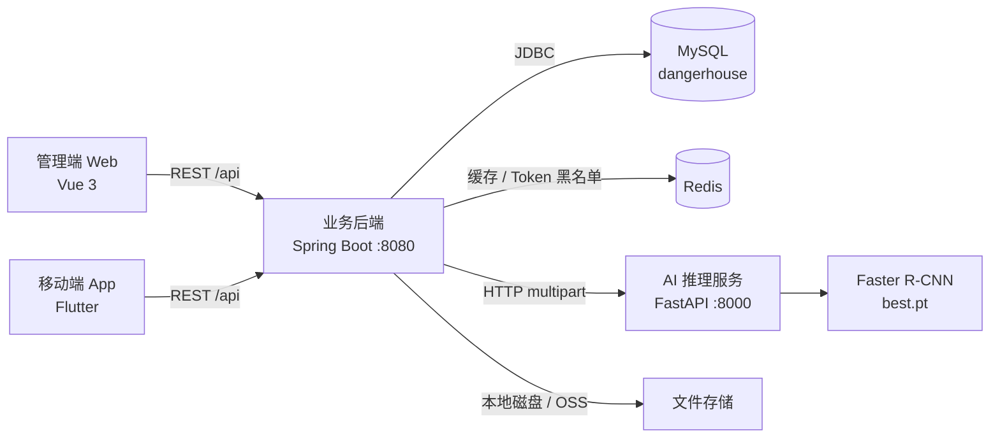

# 危房智能检测系统

面向建筑安全监管的危房检测平台。系统覆盖建筑档案管理、现场多图采集、AI 裂缝识别、A/B/C/D 风险评级、检测报告生成与后台运维的完整链路，由管理端、移动端、业务后端与 AI 推理服务四个模块组成。

## 目录

- [系统架构](#系统架构)
- [模块说明](#模块说明)
- [技术栈](#技术栈)
- [环境要求](#环境要求)
- [快速开始](#快速开始)
- [目录结构](#目录结构)
- [文档索引](#文档索引)
- [许可证](#许可证)

## 系统架构



管理员通过 Web 后台完成建筑档案维护、检测记录查看与用户管理；普通用户和检测员通过 App 采集现场照片并发起检测。业务后端接收请求、鉴权、落库，把图片转发给 AI 服务做裂缝识别与风险评级，最后生成 PDF 报告。

更详细的模块边界、请求链路与数据流见 [危房智诊系统架构图.md](./危房智诊系统架构图.md)。

## 模块说明

| 模块 | 技术栈 | 端口 | 职责 | 文档 |
| :--- | :--- | :--- | :--- | :--- |
| `dangerhouse-backend` | Spring Boot 3.2、Java 17、MyBatis-Plus、MySQL、Redis | `8080` | 业务 API、鉴权、缓存、持久化、报告生成 | [Readme](./dangerhouse-backend/Readme.md) |
| `dangerhouse-admin-web` | Vue 3、TypeScript、Element Plus、Vite | `9090` | 管理员后台 | [README](./dangerhouse-admin-web/README.md) |
| `dangerhouse-mobile-app` | Flutter、Dart、Riverpod、Dio、go_router | 平台相关 | 用户与检测员移动端 | [Readme](./dangerhouse-mobile-app/Readme.md) |
| `dangerhouse-ai-service` | FastAPI、PyTorch、Faster R-CNN | `8000` | 建筑损伤图像检测与风险分析 | [Readme](./dangerhouse-ai-service/Readme.md) |

管理端开发端口是 `9090`，由 `vite.config.ts` 硬编码指定；`.env.development` 中的 `VITE_APP_PORT=3000` 不会被读取。

## 技术栈

| 层次 | 技术 |
| :--- | :--- |
| 移动端 | Flutter 3.x、Dart、Riverpod、Dio、go_router |
| 管理端 | Vue 3.4、TypeScript 5.4、Element Plus 2.7、Pinia、Vite 5、ECharts |
| 业务后端 | Spring Boot 3.2、Spring Security、MyBatis-Plus 3.5.3.1、JJWT、OpenPDF |
| AI 服务 | FastAPI、PyTorch、torchvision、OpenCV、scikit-learn、PyQt6 |
| 数据与中间件 | MySQL 8、Redis 6 |

## 环境要求

| 依赖 | 版本 |
| :--- | :--- |
| JDK | 17 |
| MySQL | 8.0+ |
| Redis | 6.0+ |
| Node.js | 18+（`package.json` 的 engines 约束） |
| pnpm | 管理端强制使用，`preinstall` 里通过 only-allow 校验 |
| Flutter SDK | 3.2+（`pubspec.yaml` 约束 `>=3.2.0 <4.0.0`） |
| Python | 3.10+（AI 服务，GPU 可选） |

## 快速开始

按下面的顺序启动，后端依赖数据库与 Redis，检测链路依赖 AI 服务。

### 1. 初始化数据库

```bash
# 建表 + 基础角色数据
mysql -u root -p < dangerhouse-backend/sql/dangerhouse_v3.0.sql

# 建表 + 业务示例数据
mysql -u root -p < dangerhouse-backend/sql/dangerhouse_v3.0_with_data.sql
```

### 2. 启动 AI 推理服务

需要自行准备模型权重 `dangerhouse-ai-service/runs_detect/best.pt`：

```bash
cd dangerhouse-ai-service
python -m venv .venv
.\.venv\Scripts\pip install -r requirements.txt
.\.venv\Scripts\python -m uvicorn api_server:app --host 0.0.0.0 --port 8000
```

### 3. 启动业务后端

按需修改 `src/main/resources/application.yml` 中的数据库、Redis 与 AI 服务地址：

```bash
cd dangerhouse-backend
./mvnw spring-boot:run          # Windows 使用 mvnw.cmd spring-boot:run
```

Swagger UI：`http://localhost:8080/swagger-ui.html`

### 4. 启动管理后台

```bash
cd dangerhouse-admin-web
pnpm install
pnpm run dev
```

访问 `http://localhost:9090`，仅 `ADMIN` 角色账号可登录。

### 5. 运行移动端

```bash
cd dangerhouse-mobile-app
flutter pub get
dart run build_runner build --delete-conflicting-outputs
flutter run
```

后端地址通过 `--dart-define` 指定，默认 `http://localhost:8080`：

```bash
flutter run --dart-define=APP_BASE_URL=http://192.168.1.10:8080
```

## 目录结构

```
dangerHouseSystem/
├── dangerhouse-backend/       Spring Boot 业务后端
│   ├── sql/                   建表脚本与数据库说明
│   └── src/
├── dangerhouse-admin-web/     Vue 3 管理后台
│   ├── docs/                  后端接口文档
│   └── src/
├── dangerhouse-mobile-app/    Flutter 移动端
│   ├── lib/
│   └── test/
├── dangerhouse-ai-service/    FastAPI + PyTorch 推理服务
└── 危房智诊系统架构图.md
```

## 文档索引

| 文档 | 内容 |
| :--- | :--- |
| [危房智诊系统架构图.md](./危房智诊系统架构图.md) | 模块划分、请求链路、数据流 |
| [dangerhouse-backend/Readme.md](./dangerhouse-backend/Readme.md) | 接口概览、状态流转、缓存设计、配置项 |
| [dangerhouse-backend/sql/数据库说明文档.md](./dangerhouse-backend/sql/数据库说明文档.md) | 表结构与字段说明 |
| [dangerhouse-admin-web/README.md](./dangerhouse-admin-web/README.md) | 页面结构、路由与接口约定 |
| [dangerhouse-admin-web/docs/后端接口文档.md](./dangerhouse-admin-web/docs/后端接口文档.md) | 后端 REST 接口明细 |
| [dangerhouse-mobile-app/Readme.md](./dangerhouse-mobile-app/Readme.md) | 移动端结构、状态管理与网络层 |
| [dangerhouse-ai-service/Readme.md](./dangerhouse-ai-service/Readme.md) | 推理接口、风险评级规则、模型权重准备 |

## 许可证

`dangerhouse-admin-web` 的 LICENSE 继承自 vue3-element-admin 模板（MIT），第三方许可证存放于该模块的 `licenses/` 目录。
