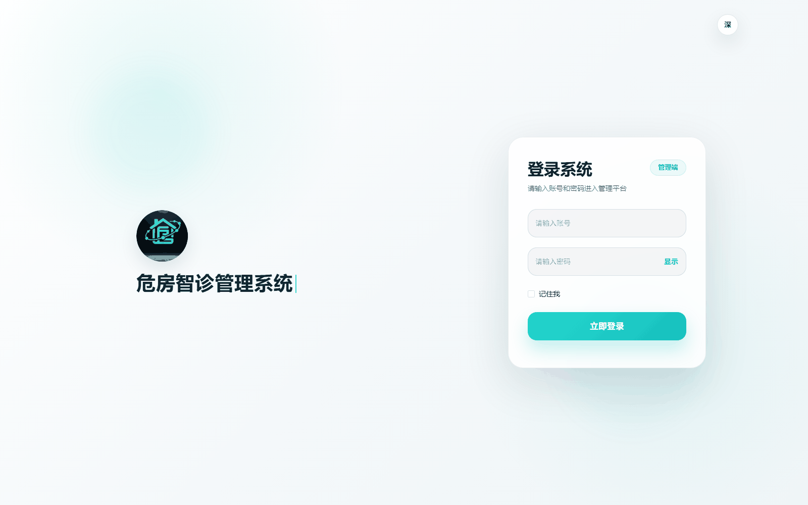

# dangerhouse-admin-web

危房智诊系统的管理端 Web 端，Vue 3 + TypeScript + Vite + Element Plus 技术栈，只允许 ADMIN 角色登录，通过 REST API 对接 Spring Boot 后端（开发默认 `http://localhost:8080`）。package.json 里 version 是 `2.9.3`。

主要依赖：vue `3.4.21` / vite `5.2.8` / typescript `5.4.5` / element-plus `2.7.0` / pinia `2.1.7` / vue-router `4.3.0` / axios `1.13.6` / echarts `5.5.0`。



## 功能范围

- 数据看板 `src/views/dashboard`：统计卡片，配合柱状图、饼图、雷达图、漏斗图（图表组件在同目录 `components/` 下，基于 ECharts 封装）
- 建筑管理 `src/views/building`：建筑列表、建筑详情、高危建筑
- 检测管理 `src/views/detection`：检测记录列表、检测详情、检测报告（报告详情与 PDF 下载）
- 系统管理 `src/views/system`：用户管理（分页查询、启用停用、设为/取消检测员）、操作日志
- 登录 `src/views/login`，错误页 `src/views/error-page/401.vue` 与 `404.vue`，路由重定向 `src/views/redirect`

一共 17 个 vue 文件，没有角色/菜单/部门/字典这类通用后台页面。系统管理这组路由是否注册由 `VITE_ENABLE_SYSTEM_PAGES` 决定，置为 `false` 时侧边栏不出现该项。

登录成功后落在 `/dashboard`。

## 技术栈

| 用途 | 依赖 | package.json 版本 |
| --- | --- | --- |
| 框架 | vue | ^3.4.21 |
| 路由 | vue-router | ^4.3.0 |
| 状态 | pinia | ^2.1.7 |
| UI | element-plus | ^2.7.0 |
| 图标 | @element-plus/icons-vue | ^2.3.1 |
| 图表 | echarts | ^5.5.0 |
| HTTP | axios | ^1.13.6 |
| 构建 | vite | ^5.2.8 |
| 类型 | typescript | ^5.4.5 |
| 样式 | sass + unocss | ^1.75.0 / ^0.58.9 |
| 规范 | eslint + prettier + stylelint | ^8.57.0 / ^3.2.5 / ^16.3.1 |
| 提交 | husky + lint-staged + cz-git | ^9.0.11 / ^15.2.2 / ^1.9.1 |

`unplugin-auto-import` 与 `unplugin-vue-components` 已接好，`ref`、`ElMessage` 以及 `src/components` 下的组件不写 import 也能用，图标走 `unplugin-icons` 的 `ep` 集合。

## 快速开始

环境要求：Node >= 18.0.0（package.json `engines`），包管理器只能用 pnpm —— `preinstall` 脚本是 `npx only-allow pnpm`，用 npm 或 yarn 装依赖会直接报错退出。后端服务需要先在 `http://localhost:8080` 启动。

```bash
cd dangerHouseSystem/dangerhouse-admin-web

pnpm install
pnpm run dev
```

`dev` 脚本是 `vite serve --mode development`。开发服务器监听 `0.0.0.0`、端口 `9090`、自动打开浏览器，访问地址是 `http://localhost:9090`。

生产构建：

```bash
pnpm run build:prod
```

`build:prod` 是 `vite build --mode production && vue-tsc --noEmit`，产物输出到 `dist/`。构建后还会跑一次 vue-tsc 类型检查，类型报错会让整条命令失败。

## 项目结构

```
dangerhouse-admin-web/
├── docs/                    # 后端接口文档
├── src/
│   ├── api/                 # 接口定义，9 个模块，按业务分目录
│   ├── assets/              # 图片与 svg 图标
│   ├── components/          # 公共组件：Pagination、Upload、SvgIcon、Breadcrumb、Hamburger、AppLink
│   ├── directive/           # 自定义指令
│   ├── enums/               # 枚举常量
│   ├── lang/                # vue-i18n 语言包
│   ├── layout/              # 主框架布局：NavBar、Sidebar、TagsView、AppMain
│   ├── plugins/             # i18n、icons、permission 路由守卫
│   ├── router/              # 仅 index.ts，静态路由 + createWebHashHistory
│   ├── store/modules/       # pinia：user、permission、app、settings、tagsView
│   ├── styles/              # 全局样式
│   ├── typings/             # 类型声明
│   ├── utils/               # request.ts 等
│   ├── views/               # 页面
│   ├── App.vue
│   └── main.ts
├── .env.development
├── .env.production
├── index.html
├── uno.config.ts
├── vite.config.ts
└── package.json
```

根目录没有 `public/` 目录，`index.html` 也不引用任何静态资源。

## 关键约定

**登录与鉴权**

- 登录请求固定带 `clientType: "WEB"`（`src/views/login/index.vue` 传入，api 层还有 `?? "WEB"` 兜底）
- token 存在 localStorage 的 `token` 键上，写入在 `src/store/modules/user.ts` 的 `login()`
- `src/utils/request.ts` 请求拦截器读 token 拼成 `Authorization: Bearer <token>`，但 URL 里含 `/auth/` 的请求不加这个头
- 响应拦截器认为 code 属于 `{200, 0, "200", "0", "00000"}` 才算成功；code 401 且不是 auth 请求时弹确认框，确认后清 token 并 `location.reload()`
- 角色校验有两处：`user.ts` 的 `getUserInfo()` 用大小写不敏感的 `=== "ADMIN"` 判断，非 ADMIN 会删 token、重置路由并抛「当前账号无权登录后台，请使用管理员账号」；`permission.ts` 再按路由 `meta.roles` 过滤一遍，roles 里带 `"ROOT"` 的账号直接放行

**路由**

- 路由是 hash 模式（`createWebHashHistory`），部署时服务器不需要配 SPA 的 history 回退
- `src/router/index.ts` 里只有静态路由：`/login`、`/redirect/:path(.*)`、`/` 下的 `dashboard`、`401`、`404`、`detection/report`
- 建筑、检测、系统三组业务路由定义在 `src/store/modules/permission.ts`，每条的 `meta.roles` 都是 `["ADMIN"]`，由登录后的角色动态生成
- `VITE_USE_BACKEND_MENUS=true` 时改从 `GET /menus/routes` 拉菜单，请求失败或返回为空则回退到上面的本地路由；当前配置是 `false`
- 路由守卫在 `src/plugins/permission.ts`，白名单只有 `["/login"]`，其余按 localStorage 里的 token 判断

**接口**

- axios 的 `baseURL` 取 `import.meta.env.VITE_APP_BASE_API`，所以 `src/api/` 里的路径一律不写 `/api` 前缀
- `VITE_SYSTEM_LOCAL_MODE=true` 时，菜单增删改查那一组接口返回本地 mock，实际只有 `GET /menus/routes` 会被请求

各模块的接口路径：

| 模块 | 主要路径 |
| --- | --- |
| `api/auth` | `POST /auth/login`、`POST /auth/register`、`POST /auth/logout`、`GET /auth/check-username/{username}` |
| `api/user` | `GET/PUT /user/profile`、`PUT /user/password`、`POST /user/avatar`、`GET /users`、`GET /users/{userId}`、`PUT /users/{userId}/status`、`PUT /users/{userId}/inspector` |
| `api/building` | `POST /buildings`、`PUT/DELETE /buildings/{id}`、`GET /buildings`、`GET /buildings/{id}`、`GET /buildings/by-owner`、`GET /buildings/by-address`、`POST /buildings/{id}/image` |
| `api/detection` | `POST /detections`、`GET /detections`、`GET /detections/{id}`、`PUT /detections/{id}/cancel`、`DELETE /detections/{id}`、`POST /detections/{id}/start`、`POST/GET /detections/{id}/images` |
| `api/report` | `POST /reports/generate`、`GET /reports`、`GET /reports/{id}`、`GET /reports/{id}/download` |
| `api/admin` | `GET /admin/dashboard`、`GET /admin/operation-logs`、`GET /admin/models` |
| `api/menu` | `GET /menus/routes`、`GET /menus`、`GET /menus/options`、`POST /menus`、`PUT /menus/{id}`、`DELETE /menus/{id}` |
| `api/file` | `POST /files`、`DELETE /files?filePath=` |
| `api/ai` | `POST /ai/detect` |

`api/ai`、`api/admin` 的模型列表、`auth/check-username` 目前没有页面调用。

## 环境变量

`.env.development`：

| 变量 | 值 | 作用 |
| --- | --- | --- |
| `VITE_APP_BASE_API` | `http://localhost:8080/api` | axios 的 baseURL |
| `VITE_APP_PORT` | `3000` | 未被读取，见下 |
| `VITE_MOCK_DEV_SERVER` | `false` | mock 服务开关，插件本身也没在 vite.config.ts 里启用 |
| `VITE_USE_BACKEND_MENUS` | `false` | 是否用后端菜单 |
| `VITE_ENABLE_SYSTEM_PAGES` | `true` | 是否注册系统管理路由 |
| `VITE_SYSTEM_LOCAL_MODE` | `true` | 菜单管理是否走本地 mock |

`.env.production` 里 `VITE_APP_BASE_API=/api`，其余开关相同。

开发环境下 `VITE_APP_BASE_API` 是完整 URL，axios 直接请求 `http://localhost:8080`，`vite.config.ts` 中那条 `"/api"` 代理不会被命中，跨域要由后端放行。

## 构建与代码规范

```bash
pnpm run lint:eslint      # eslint --fix --ext .ts,.js,.vue ./src
pnpm run lint:prettier    # prettier --write
pnpm run lint:stylelint   # stylelint "**/*.{css,scss,vue}" --fix
pnpm run lint:lint-staged # lint-staged，husky 的 pre-commit 也走这个
pnpm run build:prod
```

没有 `lint` 或 `build` 这样的简写脚本，写错了 pnpm 会报 missing script。

提交信息走 Conventional Commits，`commitlint.config.cjs` 限定了 type 枚举；用 `pnpm run commit` 可以走 cz-git 交互式生成。

## 常见问题

**用 npm 装依赖报错**

`preinstall` 是 `npx only-allow pnpm`，只能用 pnpm。装坏了的话 `pnpm store prune && rm -rf node_modules && pnpm install`。

**访问 localhost:3000 打不开**

开发端口是 9090，写在 `vite.config.ts` 的 `server.port` 里。`.env.development` 里的 `VITE_APP_PORT=3000` 只在 `src/typings/env.d.ts` 声明了类型，没有任何地方读取，改它不起作用。要换端口直接改 vite.config.ts。

**登录成功但马上被踢回登录页**

`getUserInfo()` 拿到角色后如果不是 ADMIN（大小写不敏感），会清 token 并抛「当前账号无权登录后台，请使用管理员账号」。用管理员账号登录。

**接口返回 401 后页面弹窗重载**

`request.ts` 的响应拦截器对 401 的处理就是清 token + `location.reload()`，这里不是 bug。token 过期的正常表现是重新登录一次。

**侧边栏没有「系统管理」**

检查 `.env.development` 的 `VITE_ENABLE_SYSTEM_PAGES` 是否被改成了 `false`。

**构建后页面空白**

先看控制台是否 404。`vite.config.ts` 没有配置 `base`，走的是默认 `/`，资源以绝对路径引用，部署到 `/admin` 这类子路径下会全部取不到。要么在 vite.config.ts 补 `base`，要么按根路径部署。另外路由是 hash 模式，nginx 不需要配 history 回退规则。

**后端的 401 提示语**

非 auth 请求返回 401 时弹的是前端写死的「当前登录状态已失效，请重新登录」，不是后端返回的 message。

## 参考

- `docs/后端接口文档.md`：后端全部 38 个接口的完整说明（方法、路径、权限、参数、响应示例），与后端 Controller 逐一核对过

下面是几个需要留意的前后端不一致点，接口文档里也标注了：

- `GET /reports`（报告列表）前端定义了但**后端未实现**，报告信息目前只能从 `GET /detections` 响应的 `report` 字段取
- `POST /files`、`DELETE /files` 前端定义了但**后端未实现**，`SingleUpload.vue`、`MultiUpload.vue` 是依赖它们的模板遗留组件；上传应改用业务接口（`/user/avatar`、`/buildings/{id}/image`、`/detections/{id}/images`）
- `menus` 系列后端没有对应 Controller，当前 `VITE_SYSTEM_LOCAL_MODE=true` 走本地 mock，实际生效的是前端静态路由
- `POST /auth/logout` 会被 `request.ts` 的「`/auth/` 请求不加 Authorization 头」规则挡住，导致后端拿不到令牌、退出不会拉黑 token
