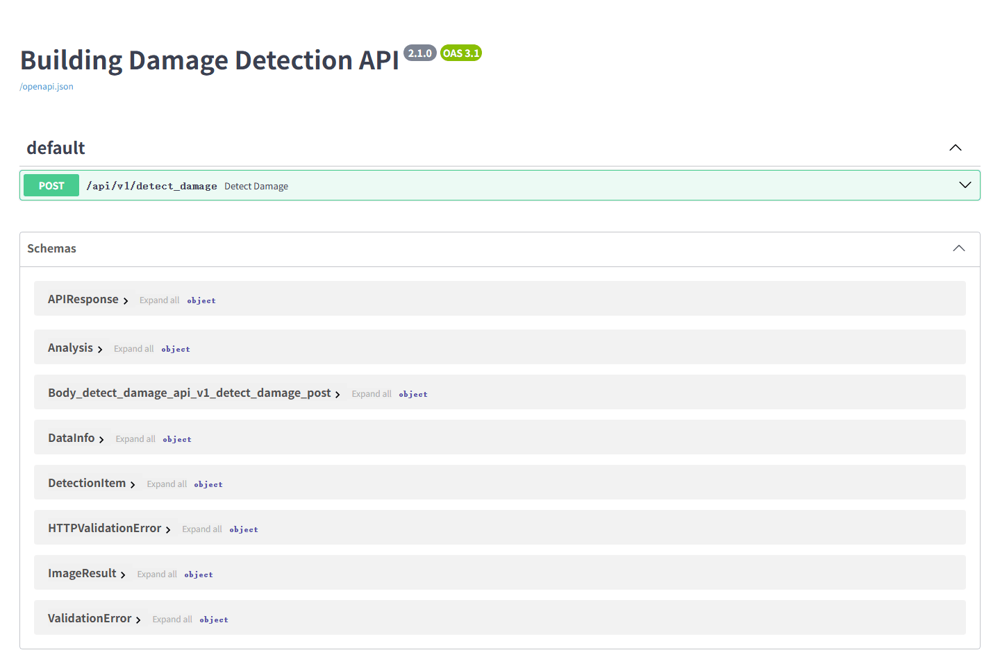

# dangerhouse-ai-service

独立的 AI 推理子服务：FastAPI 暴露一个 HTTP 接口，内部用 torchvision 的 Faster R-CNN（`fasterrcnn_resnet50_fpn_v2`，ResNet50 + FPN v2 骨干）做建筑裂缝检测，并给出 A/B/C/D 风险等级。后端 Java 服务通过 multipart 上传图片调用它，取回检测框、标注图（Base64）和评估结果。

仓库里还带了两个独立脚本：一个 PyQt6 桌面调试工具，一个训练/评估脚本。它们不参与 HTTP 服务，直接 `python xxx.py` 单独跑。

`requirements.txt` 的内容（`torch`、`torchvision`、`fastapi`、`uvicorn`、`python-multipart`、`pydantic`、`tqdm`、`scikit-learn` 均未锁定版本）：

```
PyQt6>=6.5
numpy>=1.23
opencv-python>=4.8
torch
torchvision
fastapi
uvicorn
python-multipart
pydantic
tqdm
scikit-learn
```

## 文件说明

| 文件 | 行数 | 作用 |
| --- | --- | --- |
| `api_server.py` | 277 | HTTP 服务，含模型加载、推理、风险评估、标注图生成 |
| `run_dectect.py` | 475 | HRCDS 数据集的训练/评估脚本，**训练循环已被注释**，当前只做 test 集评估与可视化 |
| `damage_detector_qt.py` | 431 | PyQt6 本地调试 GUI，进程内直接推理，不走 HTTP |
| `requirements.txt` | 11 | 依赖清单 |

`api_server.py` 和 `damage_detector_qt.py` 之间没有 import 关系，`build_model`、`load_model`、`predict_image`、`draw_boxes` 在两个文件里各写了一份（细节还不太一样，见后文），改算法时记得两边都对一遍。

## 运行

```bash
cd dangerhouse-ai-service

python -m venv .venv

# Windows
.venv\Scripts\activate
# Linux / macOS
source .venv/bin/activate

pip install -r requirements.txt

python -m uvicorn api_server:app --host 0.0.0.0 --port 8000
```

直接 `python api_server.py` 等价，文件末尾就是 `uvicorn.run("api_server:app", host="0.0.0.0", port=8000, reload=True)`。

启动后可访问：

- `http://localhost:8000/docs` — Swagger UI。代码里没有禁 `docs_url`，也没自定义文档路由，能打开纯粹是 FastAPI 的默认行为（无鉴权，生产环境自行决定要不要关）。
- `http://localhost:8000/api/v1/detect_damage` — 唯一的业务接口。



三个和启动相关的细节：

- `WEIGHT_PATH = "./runs_detect/best.pt"` 是相对路径，相对于**启动进程时的工作目录**。换目录启动会直接找不到权重。
- `DEVICE` 在模块导入时求值一次，`torch.cuda.is_available()` 为真用 `cuda`，否则 `cpu`。运行中改不了。
- `build_model` 用的是 `FasterRCNN_ResNet50_FPN_V2_Weights.DEFAULT`，会用 COCO 预训练权重初始化，首次运行需要联网下载（之后走本地缓存），离线环境需预置缓存。

## 接口

`POST /api/v1/detect_damage`

| 参数 | 位置 | 类型 | 约束 | 说明 |
| --- | --- | --- | --- | --- |
| `images` | multipart 表单字段 | `List[UploadFile]` | 必填 | 图片文件，可多张，字段名重复提交 |
| `score_thr` | query | float | `0.0 <= x <= 1.0`，默认 `0.3` | 置信度过滤阈值，低于它的框直接丢弃 |

响应体由 `APIResponse` 序列化，成功时 `code` 固定 200、`message` 固定 `"操作成功"`：

```json
{
  "code": 200,
  "message": "操作成功",
  "data": {
    "analysis": {
      "severityLevel": "B",
      "damageRatio": 8.5,
      "crackCount": 4,
      "confidenceScore": 87.2,
      "recommendation": "存在轻微损伤，建议定期观察"
    },
    "detections": [],
    "imageResults": [],
    "resultImage": "<Base64 JPEG>"
  }
}
```

| 模型 | 字段 | 类型 | 说明 |
| --- | --- | --- | --- |
| `APIResponse` | `code` / `message` / `data` | int / str / DataInfo? | 顶层结构 |
| `DataInfo` | `analysis` | Analysis | 建筑整体评估（多图去重后） |
| | `detections` | List[DetectionItem] | 所有图片的检测框汇总 |
| | `imageResults` | List[ImageResult] | 每张图一条明细 |
| | `resultImage` | str? | 第一张图的标注图，无有效图片时为 `null` |
| `ImageResult` | `filename` | str | 上传时的文件名 |
| | `detections` / `analysis` / `resultImage` | | 该图的检测框、评估、标注图 |
| `DetectionItem` | `id` | int | 全局自增（`len(all_detections_summary)+1`），跨图连续，不是图内序号 |
| | `type` / `typeName` | str | 固定 `"crack"` / `"裂缝"` |
| | `confidence` | float | 0 ~ 1 |
| | `bbox` / `center` | List[int] | `[x1,y1,x2,y2]` / `[cx,cy]` |
| | `width` / `height` / `area` | int | 框宽、框高、框面积，单位像素 |
| `Analysis` | `severityLevel` | str | `A` / `B` / `C` / `D` |
| | `damageRatio` | float | 框面积之和 / 图像面积 × 100，保留 2 位小数；重叠框会重复计入 |
| | `crackCount` | int | 单图 = 框数；建筑级 = DBSCAN 去重后的簇数 |
| | `confidenceScore` | float | 单图 = 框置信度均值 × 100；建筑级 = 各图该值的均值 |
| | `recommendation` | str | 见下方文案 |

标注图是 `cv2.rectangle` 画红框（线宽 2）+ `putText` 打分数，JPEG 编码后 Base64 塞进响应，不写文件。

### 错误处理

- `503 Model not loaded.`：代码里有（模型容器为 `None` 时抛出），但实际几乎不可达。启动阶段的 `lifespan` 一定会给容器赋值——权重文件不存在时 `load_model_instance` 只打一条 warning，然后用一个没加载自定义权重的模型继续返回。
- `422`：没有自定义 handler，完全依赖 FastAPI/Pydantic 的默认校验。`images` 缺失、`score_thr` 越界都会触发。
- 单张图解码失败（`cv2.imdecode` 返回 `None`）或处理中抛异常，会被路由内的 `try/except` 吞掉，只记一条 error 日志然后跳过这张图。所有图都失败时返回 `imageResults: []`、`detections: []`、`resultImage: null`，`analysis` 是兜底的 `A / 0 / 0 / 0 / "无有效图片"`，HTTP 状态码仍是 200。

## 风险等级判定

`classify_risk_level(crack_count, damage_ratio)` 拿裂缝数和损伤面积占比两个维度各自比对，任一维度命中就升级（取高风险的那个）：

| 等级 | 裂缝数 | 损伤面积占比 |
| --- | --- | --- |
| D | `> 10` | `> 30.0%` |
| C | `>= 6` | `>= 15.0%` |
| B | `>= 3` | `>= 5.0%` |
| A | 以上都不满足 | 以上都不满足 |

阈值常量在 `api_server.py` 顶部（`BUILDING_*_CRACK_THRESHOLD` / `BUILDING_*_RATIO_THRESHOLD`）。注意 D 级用的是严格大于，B/C 级是大于等于。

`recommendation` 按等级固定映射：

| 等级 | 文案 |
| --- | --- |
| A | 结构安全，无需处理 |
| B | 存在轻微损伤，建议定期观察 |
| C | 局部危房，建议修缮加固 |
| D | 整幢危房，建议立即停止使用并由专业机构鉴定 |

## 多图与去重

一次请求传多张图时，每张图各自推理、各自出一份 `Analysis`，然后 `evaluate_building_risk` 做建筑级汇总：

1. 把所有图所有框的中心点 `[(x1+x2)/2, (y1+y2)/2]` 收集起来，跑 `DBSCAN(eps=50, min_samples=1)`。
2. `min_samples=1` 意味着每个点至少自成一簇，不存在噪声点，`crackCount` 填的是簇的数量。
3. `damageRatio` 取各图的**最大值**（不是平均值），`confidenceScore` 取各图的平均值。
4. 用这对 `(簇数, 最大占比)` 再调一次 `classify_risk_level`。

`eps=50` 的单位是像素，而且直接作用在原始图像坐标上，不随分辨率自适应。上传的照片分辨率越高，50 像素对应的物理尺度越小，去重作用越弱。换数据源时这个参数需要重调。

## 训练与评估脚本

`run_dectect.py` 的数据根目录是 `./HRCDS`，期望结构（`{split}` 取 `train` / `val` / `test`）：

```
HRCDS/
├── train_image/          # .jpg .jpeg .png .bmp
├── train_mask/           # 按文件名 stem 匹配，兼容 <stem>_mask.png
├── train_annotations/    # 可选，COCO json
├── val_image/  val_mask/  val_annotations/
└── test_image/ test_mask/ test_annotations/
```

`CrackDetDataset` 优先从 `{split}_annotations/*.json` 读 COCO bbox；读不到就退回 mask 自动推：像素最多的灰度值/颜色当背景，其余算前景，可选 `MORPH_RECT(9,9)` 闭运算平滑两遍，再 `connectedComponentsWithStats` 取连通域外接矩形，面积小于 `MIN_AREA_PX` 的丢掉。图片目录不存在会直接 `FileNotFoundError`，mask 匹配不上会明确指出是哪个 stem 没配上。

脚本顶部超参：

| 常量 | 值 | 说明 |
| --- | --- | --- |
| `EPOCHS` | 20 | 训练轮数（当前不生效，见下） |
| `BATCH_SIZE` | 8 | train loader；val/test loader 的 batch_size 硬编码为 8 |
| `LR` | 2e-5 | 配 `AdamW(lr=2e-5, weight_decay=1e-4)` |
| `NUM_WORKERS` | 4 | 报错时改 0 便于调试 |
| `MIN_AREA_PX` | 120 | 过滤碎框 |
| `NUM_CLASSES` | 2 | 背景 + 裂缝 |
| `EVAL_SCORE_THR` | 0.05 | 评估默认分数阈值 |
| `IOU_THR` | 0.5 | 匹配用 IoU 阈值 |
| `USE_MORPH` | True | 是否做形态学平滑 |

训练相关的代码（AMP `GradScaler`、`clip_grad_norm_(..., 5.0)`、每轮 `evaluate_best_f1`、保存 `checkpoint.pt` / `best.pt` / `best_threshold.txt`）都写在 `main()` 里，但**第 400-452 行的训练循环整段被注释掉了**。断点续训的读取逻辑（读 `checkpoint.pt`）还留着，同样不会触发，因为只有训练循环才会写它。

所以现在 `python run_dectect.py` 的真实行为是：加载 `./runs_detect/best.pt`（若存在）和 `./runs_detect/best_threshold.txt`，在 test 集上跑 `evaluate_map50` 打印 P/R/F1，然后把最多 50 张可视化结果写到 `./runs_detect/test_vis/`。**它不训练，也不产出 best.pt**，要恢复训练得把那段注释解开。

评估函数是简化实现：`evaluate_map50` 是 IoU@0.5 下的 P/R/F1（贪心匹配，每个 GT 只匹配一次），`evaluate_best_f1` 在 `[0.05, 0.1, 0.15, 0.2, 0.25, 0.3, 0.4, 0.5, 0.6]` 上网格搜 F1 最高的阈值。

## 权重与数据集准备

`runs_detect/`、`HRCDS/` 都不在仓库里，`.gitignore` 明确排除了这两个目录，以及 `*.pt` / `*.pth` / `*.zip` 等大文件。推理服务需要的就是一个 `runs_detect/best.pt`，内容是 `model.state_dict()` 保存的纯权重，`load_state_dict` 直接读，没有包装字典。由于训练脚本不能产出它，这个文件需要外部提供。

## 桌面调试工具

```bash
python damage_detector_qt.py
```

PyQt6 界面，在自己进程里建模型、跑推理，不经过 HTTP，也不依赖 `api_server.py`。界面上能调的参数：

| 控件 | 默认值 | 范围 |
| --- | --- | --- |
| 阈值滑条 | 0.50 | 0.00 ~ 1.00（滑条 0 ~ 100） |
| 每图最多框 | 30 | 1 ~ 200 |
| NMS 阈值 | 0.30 | 0.10 ~ 0.90 |
| 标签显示 | `damage` | 任意文本，只影响画在框上的字 |

支持加载 `best.pt`、打开单图、批量处理整个文件夹。批量处理输出到 `{所选文件夹}/detect_out/`：`vis/<stem>_vis.jpg`、`json/<stem>.json`，再加一份 `summary.json`。

和 `api_server.py` 的差别：权重文件不存在时 `load_model` 直接抛 `FileNotFoundError`，不会像服务端那样降级成未加载权重的模型继续跑。

## 与后端对接

后端 `dangerhouse-backend/src/main/resources/application.yml`：

```yaml
ai:
  detection:
    url: http://127.0.0.1:8000/api/v1/detect_damage
```

Multipart 字段名必须是 `images`。CORS 配的是 `allow_origins=["*"]` 加 `allow_credentials=True`，这个组合在浏览器同源策略下不合法，不过后端是服务端直连，不受影响。

许可协议与 monorepo 其他子项目一致，见 `../dangerhouse-admin-web/LICENSE`。

## 已知限制

- **训练循环被注释**，`run_dectect.py` 目前只是评估 + 可视化脚本，产不出权重。
- **没有健康检查接口**。`api_server.py` 里没有任何 GET 路由，也没有 `/health`、`/healthz`。想探活只能真发一张图打 `POST /api/v1/detect_damage`，或者看 `/docs` 能不能打开。
- **权重缺失不报错**。服务照常启动、接口照常返回 200，但检测头是随机初始化的，输出不可用。唯一的判断依据是启动日志里的 `Weights not found at ...`。所谓 `503` 在这个流程下基本不会出现。
- 多图去重的 `eps=50` 是像素级参数，不随分辨率自适应。
- `DEVICE` 只在进程启动时判定一次。
- 单张图出错会被静默跳过，只在日志里留一条 error。接到 200 不代表每张图都处理成功，客户端得自己核对 `imageResults` 条数和上传数量是否一致。
- `damage_detector_qt.py` 与 `api_server.py` 的推理代码是两份拷贝，行为已经有差异（权重缺失时的处理），改动容易漏。
