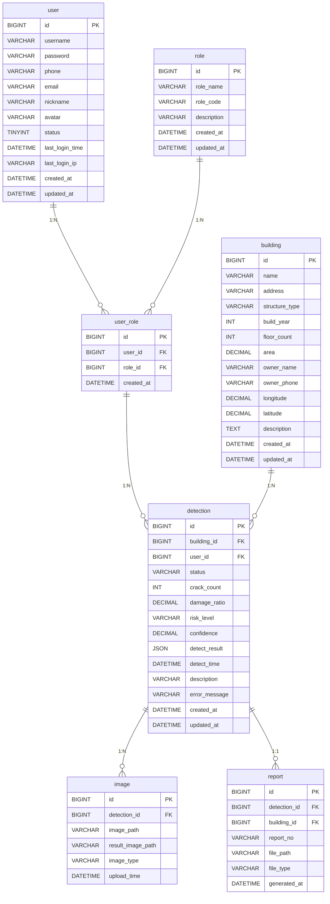
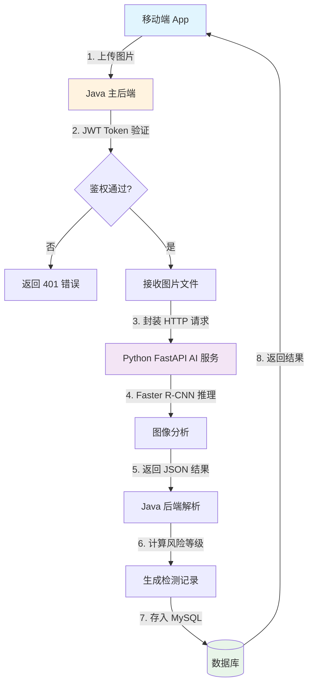
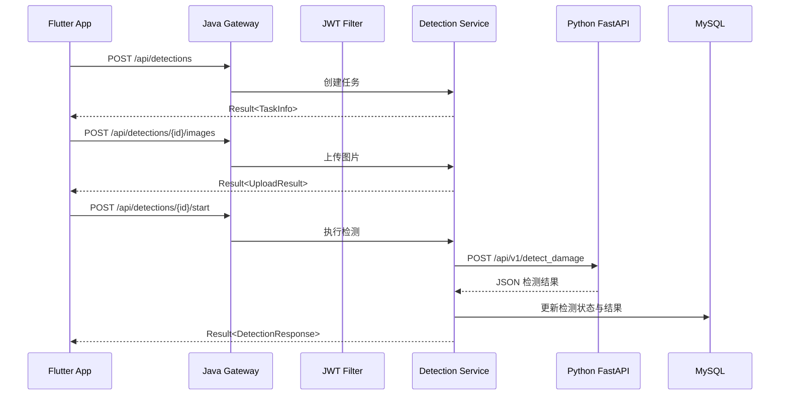
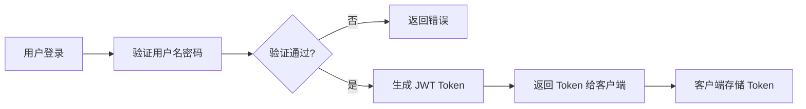

# 危房智能检测系统 - 后端系统设计与 API 说明文档

> **版本：** v3.3
> **最后更新：** 2026年4月15日

---

## 目录

1. [系统概述](#1-系统概述-system-overview)
2. [架构设计](#2-架构设计-architecture-design)
3. [核心数据库设计](#3-核心数据库设计-database-design)
4. [核心业务流程流转图](#4-核心业务流程流转图-core-business-flow)
5. [API 接口规范与示例](#5-api-接口规范与示例-api-specifications)
6. [异常与安全处理](#6-异常与安全处理-security--exception-handling)
7. [部署建议](#7-部署建议-deployment)
8. [更新日志](#8-更新日志-changelog)

---

## 1. 系统概述 (System Overview)

### 1.1 项目背景

**危房智能检测系统 (Dangerous House Intelligent Detection System)**
是一套基于人工智能技术的建筑安全检测解决方案。系统通过深度学习算法（Faster R-CNN ResNet50
v2）对建筑图像进行智能分析，自动识别裂缝、墙体变形等危险特征，并结合 DBSCAN 聚类算法进行去重与综合评估，最终评估建筑风险等级。

### 1.2 整体架构

本系统采用**微服务架构思想的前后端分离架构**，主要包含以下组件：

| 组件             | 技术栈                    | 职责                          |
|----------------|------------------------|-----------------------------|
| Flutter 移动端    | Flutter 3.x            | 移动端应用，支持 Android/iOS        |
| Vue 3 管理后台     | Vue 3 + Element Plus   | 系统管理、数据可视化                  |
| **Java 主业务后端** | Spring Boot 3.2        | 业务逻辑处理、数据持久化、服务调度           |
| Python AI 微服务  | FastAPI + Faster R-CNN | 图像识别、联合风险分析推理、DBSCAN 空间聚类去重 |

### 1.3 主业务后端核心职责

Java 主业务后端作为系统的核心枢纽，承担以下职责：

- **用户鉴权与授权**：基于 JWT 的无状态身份认证，支持多角色权限控制
- **业务数据持久化**：建筑档案管理、检测记录存储、报告归档
- **AI 算法调度**：接收移动端图像，转发至 Python 微服务进行推理分析
- **风险等级计算**：解析 AI 推理结果，综合计算建筑风险等级
- **报告生成**：根据检测结果自动生成检测报告
- **API 网关**：统一接口管理，提供 RESTful API 服务

---

## 2. 架构设计 (Architecture Design)

### 2.1 技术栈总览

| 分类       | 技术选型                  | 版本      |
|----------|-----------------------|---------|
| 核心框架     | Spring Boot           | 3.2.0   |
| JDK 版本   | Java                  | 17      |
| ORM 框架   | MyBatis-Plus          | 3.5.3.1 |
| 安全框架     | Spring Security       | 6.x     |
| Token 方案 | JJWT                  | 0.11.5  |
| 数据库      | MySQL                 | 8.0+    |
| API 文档   | SpringDoc (Swagger 3) | 2.2.0   |
| 工具库      | Hutool                | 5.8.22  |
| 简化编码     | Lombok                | -       |

### 2.2 分层架构设计

本系统采用经典的 **DDD（领域驱动设计）分层架构**，结合 MVC 模式进行组织：

```
┌─────────────────────────────────────────────────────────────────┐
│                        Presentation Layer                        │
│                     (Controller / REST API)                      │
│    接收HTTP请求、参数校验、调用Service、返回统一响应格式            │
├─────────────────────────────────────────────────────────────────┤
│                        Application Layer                         │
│                         (Service / DTO)                          │
│    业务逻辑处理、事务管理、数据转换、跨领域服务编排                 │
├─────────────────────────────────────────────────────────────────┤
│                          Domain Layer                            │
│                      (Entity / Model / Enum)                     │
│    领域模型定义、业务规则封装、值对象                             │
├─────────────────────────────────────────────────────────────────┤
│                       Infrastructure Layer                       │
│                    (Mapper / Repository / Client)                │
│    数据持久化、外部服务集成、缓存实现                             │
└─────────────────────────────────────────────────────────────────┘
```

### 2.3 包结构设计

```
com.dz.dangerhouse
├── common/                     # 通用模块
│   ├── Result.java            # 统一响应封装
│   └── RiskLevel.java         # 风险等级枚举
├── config/                     # 配置模块
│   ├── SecurityConfig.java    # Spring Security 安全配置
│   ├── CorsConfig.java        # 跨域配置
│   ├── RestTemplateConfig.java # RestTemplate 配置
│   └── MyMetaObjectHandler.java # MyBatis-Plus 自动填充
├── controller/                 # 控制器层
│   ├── AuthController.java    # 认证控制器（登录/注册）
│   ├── UserController.java    # 用户管理控制器
│   ├── BuildingController.java    # 建筑管理控制器
│   ├── DetectionController.java   # 检测管理控制器
│   ├── AiController.java        # AI 服务控制器
│   ├── ReportController.java    # 报告管理控制器
│   ├── AdminController.java     # 系统管理控制器
│   └── HealthController.java    # 健康检查控制器
├── dto/                        # 数据传输对象
│   ├── LoginRequest.java      # 登录请求DTO
│   ├── LoginResponse.java     # 登录响应DTO
│   ├── RegisterRequest.java   # 注册请求DTO
│   ├── RegisterResponse.java  # 注册响应DTO
│   ├── UserInfoResponse.java  # 用户信息响应DTO
│   ├── UserUpdateRequest.java # 用户信息更新DTO
│   ├── PasswordUpdateRequest.java # 密码更新请求DTO
│   ├── UserListResponse.java  # 用户列表响应DTO
│   ├── DetectionResultDto.java # 检测结果响应DTO
│   └── AiDetectionResponse.java # AI检测响应DTO
├── entity/                     # 实体类
│   ├── User.java              # 用户实体
│   ├── Building.java          # 建筑实体
│   ├── Detection.java         # 检测记录实体
│   ├── Image.java             # 检测图片实体
│   ├── Report.java            # 检测报告实体
│   ├── Role.java              # 角色实体
│   ├── UserRole.java          # 用户角色关联
│   └── OperationLog.java      # 操作日志实体
├── exception/                  # 异常类
│   ├── BusinessException.java # 业务异常类
│   └── GlobalExceptionHandler.java # 全局异常处理器
├── filter/                     # 过滤器
│   └── JwtAuthenticationFilter.java # JWT认证过滤器
├── mapper/                     # 数据访问层
│   ├── UserMapper.java        # 用户Mapper
│   ├── BuildingMapper.java    # 建筑档案Mapper
│   ├── DetectionMapper.java   # 检测记录Mapper
│   ├── ImageMapper.java       # 检测图片Mapper
│   ├── ReportMapper.java      # 检测报告Mapper
│   ├── UserRoleMapper.java    # 用户角色关联Mapper
│   ├── RoleMapper.java        # 角色Mapper
│   └── OperationLogMapper.java # 操作日志Mapper
├── repository/                 # 仓储层
│   └── UserRepository.java
├── service/                    # 服务层接口
│   ├── AuthService.java       # 认证服务
│   ├── UserService.java       # 用户服务
│   ├── BuildingService.java   # 建筑服务
│   ├── DetectionService.java  # 检测服务
│   ├── OperationLogService.java # 操作日志服务
│   ├── CustomUserDetailsService.java # Spring Security用户详情服务
│   ├── impl/                  # 服务层实现
│       ├── AuthServiceImpl.java
│       ├── UserServiceImpl.java
│       ├── BuildingServiceImpl.java
│       ├── DetectionServiceImpl.java
│       └── OperationLogServiceImpl.java
├── client/                     # 外部服务集成
│   └── AiDetectionClient.java # AI检测服务客户端
└── util/                       # 工具类
    ├── JwtUtil.java           # JWT工具类
    ├── PasswordUtil.java      # 密码工具类
    ├── FileUploadUtil.java    # 文件上传工具类
    └── JwtKeyGenerator.java   # JWT密钥生成器
```

### 2.4 各层职责说明

| 层级             | 组件     | 职责描述                                |
|----------------|--------|-------------------------------------|
| **Controller** | 控制器    | 接收 HTTP 请求，参数校验，调用 Service 层，封装统一响应 |
| **Service**    | 服务层    | 核心业务逻辑处理，事务管理，领域服务编排                |
| **Mapper**     | 数据访问层  | 基于 MyBatis-Plus 的数据库 CRUD 操作        |
| **Entity**     | 实体层    | 数据库表映射，领域模型定义                       |
| **DTO**        | 数据传输对象 | 前后端数据交互的载体，隔离实体与接口                  |
| **Client**     | 外部服务层  | 调用第三方服务（如 Python AI 微服务）            |
| **Filter**     | 过滤器    | 请求拦截、JWT Token 验证、权限校验              |
| **Exception**  | 异常处理   | 全局异常处理器，统一异常响应格式                    |

---

## 3. 核心数据库设计 (Database Design)

### 3.1 数据库概述

- **数据库名称：** `dangerhouse`
- **字符集：** `utf8mb4`
- **排序规则：** `utf8mb4_0900_ai_ci`
- **ORM 框架：** MyBatis-Plus（支持自动填充）
- **数据库版本：** MySQL 8.0+

### 3.2 核心数据表设计

#### 3.2.1 用户表 (`user`)

存储系统用户信息，支持多角色权限控制。

| 字段名               | 数据类型         | 是否必填 | 默认值               | 说明             |
|-------------------|--------------|------|-------------------|----------------|
| `id`              | BIGINT       | 是    | 自增                | 用户ID（主键）       |
| `username`        | VARCHAR(50)  | 是    | -                 | 用户名（唯一）        |
| `password`        | VARCHAR(255) | 是    | -                 | 密码（BCrypt加密）   |
| `phone`           | VARCHAR(20)  | 否    | NULL              | 手机号            |
| `email`           | VARCHAR(100) | 否    | NULL              | 邮箱地址           |
| `nickname`        | VARCHAR(50)  | 否    | NULL              | 昵称             |
| `avatar`          | VARCHAR(255) | 否    | NULL              | 头像URL          |
| `status`          | TINYINT      | 否    | 1                 | 状态（1-正常, 0-禁用） |
| `last_login_time` | DATETIME     | 否    | NULL              | 最后登录时间         |
| `last_login_ip`   | VARCHAR(45)  | 否    | NULL              | 最后登录IP         |
| `created_at`      | DATETIME     | 是    | CURRENT_TIMESTAMP | 创建时间           |
| `updated_at`      | DATETIME     | 是    | CURRENT_TIMESTAMP | 更新时间           |

**索引设计：**

- 主键索引：`id`
- 唯一索引：`uk_username` (username)
- 唯一索引：`uk_email` (email)
- 普通索引：`idx_status` (status)
- 普通索引：`idx_created_at` (created_at)

---

#### 3.2.2 角色表 (`role`)

用于后台权限管理，定义系统角色。

| 字段名           | 数据类型         | 是否必填 | 默认值               | 说明                         |
|---------------|--------------|------|-------------------|----------------------------|
| `id`          | BIGINT       | 是    | 自增                | 角色ID（主键）                   |
| `role_name`   | VARCHAR(50)  | 是    | -                 | 角色名称                       |
| `role_code`   | VARCHAR(50)  | 是    | -                 | 角色编码（ADMIN/INSPECTOR/USER） |
| `description` | VARCHAR(255) | 否    | NULL              | 角色描述                       |
| `created_at`  | DATETIME     | 是    | CURRENT_TIMESTAMP | 创建时间                       |
| `updated_at`  | DATETIME     | 是    | CURRENT_TIMESTAMP | 更新时间                       |

**索引设计：**

- 主键索引：`id`
- 唯一索引：`uk_role_code` (role_code)

**示例角色：**

- ADMIN：系统管理员，拥有所有权限
- INSPECTOR：检测员，进行危房检测
- USER：普通用户

---

#### 3.2.3 用户角色关系表 (`user_role`)

用于维护系统角色分配关系，底层保留 RBAC 扩展能力。

| 字段名          | 数据类型     | 是否必填 | 默认值               | 说明       |
|--------------|----------|------|-------------------|----------|
| `id`         | BIGINT   | 是    | 自增                | 主键ID     |
| `user_id`    | BIGINT   | 是    | -                 | 用户ID（外键） |
| `role_id`    | BIGINT   | 是    | -                 | 角色ID（外键） |
| `created_at` | DATETIME | 是    | CURRENT_TIMESTAMP | 创建时间     |

**索引设计：**

- 主键索引：`id`
- 唯一索引：`uk_user_role` (user_id, role_id)
- 普通索引：`idx_user_id` (user_id)
- 普通索引：`idx_role_id` (role_id)

**外键约束：**

- FOREIGN KEY (user_id) REFERENCES user(id) ON DELETE CASCADE
- FOREIGN KEY (role_id) REFERENCES role(id) ON DELETE CASCADE

**当前业务口径：**

- `ADMIN` 为后台管理角色，仅允许登录 Web 后台
- `USER` 与 `INSPECTOR` 在当前阶段按“单一业务身份”运行
- 管理员执行“设置检测员”时，普通用户会从 `USER` 切换为 `INSPECTOR`
- 管理员取消检测员时，检测员会从 `INSPECTOR` 切回 `USER`

---

#### 3.2.4 建筑档案表 (`building`)

记录每个危房建筑的基础信息档案。

| 字段名                     | 数据类型          | 是否必填 | 默认值               | 说明                                              |
|-------------------------|---------------|------|-------------------|-------------------------------------------------|
| `id`                    | BIGINT        | 是    | 自增                | 建筑ID（主键）                                        |
| `name`                  | VARCHAR(100)  | 是    | -                 | 建筑名称                                            |
| `address`               | VARCHAR(255)  | 是    | -                 | 建筑地址                                            |
| `structure_type`        | VARCHAR(50)   | 否    | NULL              | 结构类型（BRICK_MIX/CONCRETE/STEEL/BRICK_WOOD/OTHER） |
| `build_year`            | INT           | 否    | NULL              | 建造年份                                            |
| `floor_count`           | INT           | 否    | NULL              | 楼层数                                             |
| `area`                  | DECIMAL(10,2) | 否    | NULL              | 建筑面积(平方米)                                       |
| `owner_name`            | VARCHAR(50)   | 否    | NULL              | 业主姓名                                            |
| `owner_phone`           | VARCHAR(20)   | 否    | NULL              | 业主电话                                            |
| `longitude`             | DECIMAL(10,6) | 否    | NULL              | 经度                                              |
| `latitude`              | DECIMAL(10,6) | 否    | NULL              | 纬度                                              |
| `description`           | TEXT          | 否    | NULL              | 建筑描述                                            |
| `image_path`            | VARCHAR(255)  | 否    | NULL              | 建筑图片路径                                          |
| `owner_user_id`         | BIGINT        | 否    | NULL              | 绑定的普通用户账号 ID，可为空                                |
| `created_by`            | BIGINT        | 否    | NULL              | 建筑档案创建人 ID                                      |
| `created_by_role`       | BIGINT        | 否    | NULL              | 创建人角色 ID，存储 `role.id`                           |
| `assigned_inspector_id` | BIGINT        | 否    | NULL              | 当前跟进检测员 ID，可为空                                  |
| `created_at`            | DATETIME      | 是    | CURRENT_TIMESTAMP | 创建时间                                            |
| `updated_at`            | DATETIME      | 是    | CURRENT_TIMESTAMP | 更新时间                                            |

**索引设计：**

- 主键索引：`id`
- 普通索引：`idx_name` (name)
- 普通索引：`idx_address` (address)
- 普通索引：`idx_created_at` (created_at)

**业务说明：**

- `owner_name / owner_phone` 表示业务上的户主信息，不作为权限判断依据
- `owner_user_id` 表示当前是否已绑定平台注册普通用户账号，可为空
- `created_by` 记录建筑档案创建人
- `created_by_role` 统一存储角色 ID，由应用层映射为角色中文名称展示
- `assigned_inspector_id` 为预留的跟进检测员字段，当前阶段主要用于业务展示和后续扩展

---

#### 3.2.5 检测记录表 (`detection`)

AI 检测算法结果记录。

| 字段名             | 数据类型          | 是否必填 | 默认值               | 说明            |
|-----------------|---------------|------|-------------------|---------------|
| `id`            | BIGINT        | 是    | 自增                | 检测记录 ID（主键）   |
| `building_id`   | BIGINT        | 是    | -                 | 建筑 ID（外键）     |
| `user_id`       | BIGINT        | 否    | NULL              | 检测人用户 ID（外键）  |
| `status`        | VARCHAR(20)   | 否    | 'CREATED'         | 检测状态          |
| `crack_count`   | INT           | 否    | 0                 | 裂缝数量          |
| `damage_ratio`  | DECIMAL(10,4) | 否    | NULL              | 损伤比例 (0-100)  |
| `risk_level`    | VARCHAR(20)   | 否    | NULL              | 风险等级（A/B/C/D） |
| `confidence`    | DECIMAL(5,2)  | 否    | NULL              | 检测置信度 (0-100) |
| `detect_result` | JSON          | 否    | NULL              | 检测结果 JSON     |
| `detect_time`   | DATETIME      | 否    | CURRENT_TIMESTAMP | 检测时间          |
| `description`   | VARCHAR(500)  | 否    | NULL              | 检测描述          |
| `error_message` | VARCHAR(500)  | 否    | NULL              | 错误信息          |
| `created_at`    | DATETIME      | 是    | CURRENT_TIMESTAMP | 创建时间          |
| `updated_at`    | DATETIME      | 是    | CURRENT_TIMESTAMP | 更新时间          |

**业务说明：**

- `user_id` 当前阶段表示检测记录的发起人 / 创建人
- 当前业务为“创建检测后立即执行检测”，因此暂不拆分“创建人”和“检测人”字段
- 普通用户仅可访问自己的检测记录
- 检测员与管理员可按权限查看更大范围的检测数据

**检测状态流转：**

```
CREATED → READY → PROCESSING → COMPLETED
    ↓         ↓          ↓
  CANCELLED  CANCELLED   FAILED
```

| 状态           | 说明        |
|--------------|-----------|
| `CREATED`    | 已创建，待上传图片 |
| `READY`      | 已就绪，待启动检测 |
| `PROCESSING` | 检测处理中     |
| `COMPLETED`  | 检测完成      |
| `FAILED`     | 检测失败      |
| `CANCELLED`  | 已取消       |

**索引设计：**

- 主键索引：`id`
- 普通索引：`idx_building_id` (building_id)
- 普通索引：`idx_user_id` (user_id)
- 普通索引：`idx_detect_time` (detect_time)
- 普通索引：`idx_risk_level` (risk_level)
- 普通索引：`idx_status` (status)

**外键约束：**

- FOREIGN KEY (building_id) REFERENCES building(id) ON DELETE CASCADE
- FOREIGN KEY (user_id) REFERENCES user(id) ON DELETE SET NULL

---

#### 3.2.6 图片表 (`image`)

一个检测可以上传多张图片。

| 字段名                 | 数据类型         | 是否必填 | 默认值               | 说明             |
|---------------------|--------------|------|-------------------|----------------|
| `id`                | BIGINT       | 是    | 自增                | 图片ID（主键）       |
| `detection_id`      | BIGINT       | 是    | -                 | 检测记录ID（外键）     |
| `image_path`        | VARCHAR(255) | 是    | -                 | 原始图片路径         |
| `result_image_path` | VARCHAR(255) | 否    | NULL              | 检测结果图片路径       |
| `image_type`        | VARCHAR(20)  | 否    | NULL              | 图片类型（墙体/屋顶/整体） |
| `upload_time`       | DATETIME     | 是    | CURRENT_TIMESTAMP | 上传时间           |

**索引设计：**

- 主键索引：`id`
- 普通索引：`idx_detection_id` (detection_id)
- 普通索引：`idx_image_type` (image_type)

**外键约束：**

- FOREIGN KEY (detection_id) REFERENCES detection(id) ON DELETE CASCADE

---

#### 3.2.7 检测报告表 (`report`)

生成 Word / PDF 报告。

| 字段名            | 数据类型         | 是否必填 | 默认值               | 说明             |
|----------------|--------------|------|-------------------|----------------|
| `id`           | BIGINT       | 是    | 自增                | 报告ID（主键）       |
| `detection_id` | BIGINT       | 是    | -                 | 检测记录ID（外键）     |
| `building_id`  | BIGINT       | 是    | -                 | 建筑ID（外键）       |
| `report_no`    | VARCHAR(50)  | 是    | -                 | 报告编号（唯一）       |
| `file_path`    | VARCHAR(255) | 否    | NULL              | 报告文件路径         |
| `file_type`    | VARCHAR(20)  | 否    | PDF               | 文件类型（PDF/WORD） |
| `generated_at` | DATETIME     | 是    | CURRENT_TIMESTAMP | 生成时间           |

**索引设计：**

- 主键索引：`id`
- 唯一索引：`uk_report_no` (report_no)
- 普通索引：`idx_detection_id` (detection_id)
- 普通索引：`idx_building_id` (building_id)
- 普通索引：`idx_generated_at` (generated_at)

**外键约束：**

- FOREIGN KEY (detection_id) REFERENCES detection(id) ON DELETE CASCADE
- FOREIGN KEY (building_id) REFERENCES building(id) ON DELETE CASCADE

---

#### 3.2.8 操作日志表 (`operation_log`)

后台管理日志，记录所有用户操作。

| 字段名           | 数据类型         | 是否必填 | 默认值               | 说明            |
|---------------|--------------|------|-------------------|---------------|
| `id`          | BIGINT       | 是    | 自增                | 日志ID（主键）      |
| `user_id`     | BIGINT       | 否    | NULL              | 操作用户ID（外键）    |
| `operation`   | VARCHAR(100) | 否    | NULL              | 操作类型          |
| `method`      | VARCHAR(200) | 否    | NULL              | 接口方法          |
| `params`      | TEXT         | 否    | NULL              | 请求参数（JSON格式）  |
| `result`      | TEXT         | 否    | NULL              | 响应结果（JSON格式）  |
| `ip`          | VARCHAR(45)  | 否    | NULL              | 操作IP          |
| `status`      | TINYINT      | 否    | 1                 | 操作状态（1成功 0失败） |
| `error_msg`   | VARCHAR(500) | 否    | NULL              | 错误信息          |
| `create_time` | DATETIME     | 是    | CURRENT_TIMESTAMP | 创建时间          |

**索引设计：**

- 主键索引：`id`
- 普通索引：`idx_user_id` (user_id)
- 普通索引：`idx_operation` (operation)
- 普通索引：`idx_create_time` (create_time)
- 普通索引：`idx_status` (status)

**外键约束：**

- FOREIGN KEY (user_id) REFERENCES user(id) ON DELETE SET NULL

---

### 3.3 数据库关系结构

#### 核心关系说明

```
user  ─── user_role ─── role

user 1 ─── N detection

building 1 ─── N detection

detection 1 ─── N image

detection 1 ─── 1 report
```

#### 完整ER关系图



---

## 4. 核心业务流程流转图 (Core Business Flow)

### 4.1 移动端发起检测任务流程

本节详细描述用户通过移动端 App 上传图片进行危房检测的完整后端处理链路。

#### 4.1.1 流程概览



#### 4.1.2 详细流程说明

| 步骤         | 处理节点           | 详细说明                                                                                     |
|------------|----------------|------------------------------------------------------------------------------------------|
| **Step 1** | 移动端 App        | 用户选择建筑，拍摄或上传建筑图片，点击"开始检测"                                                                |
| **Step 2** | Java 后端 - 鉴权   | `JwtAuthenticationFilter` 拦截请求，从 Header 中提取 `Authorization: Bearer <token>`，验证 Token 有效性 |
| **Step 3** | Java 后端 - 请求处理 | Controller 接收 `MultipartFile`，调用 `AiDetectionClient` 发起 HTTP POST 请求                     |
| **Step 4** | Python AI 服务   | FastAPI 接收多张图片，调用 Faster R-CNN ResNet50 v2 模型进行损伤检测，利用 DBSCAN 进行空间去重分析                   |
| **Step 5** | Python AI 服务   | 返回适配 Java DTO 的 JSON 结果（包含整体评估、单图详情及 Base64 标注图）                                         |
| **Step 6** | Java 后端 - 结果处理 | 解析 AI 返回的 JSON，根据裂缝数量、面积占比等指标计算风险等级                                                      |
| **Step 7** | 数据持久化          | 将检测记录存入 `detection` 表，生成检测报告存入 `report` 表                                                |
| **Step 8** | 响应返回           | 封装 `Result<DetectionResponse>` 返回给移动端                                                    |

#### 4.1.3 风险等级计算规则

依据《危险房屋鉴定标准》，风险等级划分为四个等级：

| 风险等级  | 裂缝数量   | 裂缝面积占比  | 说明             | 颜色标识  |
|-------|--------|---------|----------------|-------|
| **A** | 0-2 条  | < 5%    | 无危险点（结构安全）     | 🟢 绿色 |
| **B** | 3-5 条  | 5%-15%  | 有危险点（结构基本安全）   | 🟡 黄色 |
| **C** | 6-10 条 | 15%-30% | 局部危房（部分承重结构危险） | 🟠 橙色 |
| **D** | > 10 条 | > 30%   | 整幢危房（整体处于危险状态） | 🔴 红色 |

#### 4.1.4 时序图



---

## 5. API 接口规范与示例 (API Specifications)

### 5.1 统一响应格式

所有 API 接口均返回统一的 JSON 响应格式：

```json
{
  "code": 200,
  "message": "操作成功",
  "data": {
    ...
  }
}
```

#### 响应码定义

| 响应码   | 含义    | 说明           |
|-------|-------|--------------|
| `200` | 成功    | 请求处理成功       |
| `400` | 参数错误  | 请求参数不合法      |
| `401` | 未授权   | Token 无效或已过期 |
| `403` | 禁止访问  | 无权限访问该资源     |
| `404` | 资源不存在 | 请求的资源未找到     |
| `500` | 服务器错误 | 内部处理异常       |

#### 统一响应类实现

```java

@Data
public class Result<T> implements Serializable {
    private Integer code;      // 响应码
    private String message;    // 响应消息
    private T data;           // 响应数据

    public static <T> Result<T> success(T data) {
        return new Result<>(200, "操作成功", data);
    }

    public static <T> Result<T> fail(String message) {
        return new Result<>(500, message);
    }
}
```

### 5.2 用户登录接口

#### 接口信息

| 项目               | 说明                     |
|------------------|------------------------|
| **接口路径**         | `POST /api/auth/login` |
| **接口描述**         | 用户登录认证，获取 JWT Token    |
| **认证要求**         | 无需 Token               |
| **Content-Type** | `application/json`     |

#### 请求参数

| 参数名          | 类型      | 必填 | 说明                                  |
|--------------|---------|----|-------------------------------------|
| `account`    | String  | 是  | 用户名 / 手机号 / 邮箱                      |
| `password`   | String  | 是  | 密码（明文传输，建议 HTTPS）                   |
| `rememberMe` | Boolean | 否  | 是否启用长会话，`true` 为 3 天，`false` 为 1 小时 |
| `clientType` | String  | 是  | 登录端类型，取值为 `APP` 或 `WEB`             |

#### 请求示例

```bash
curl -X POST "http://localhost:8080/api/auth/login" \
     -H "Content-Type: application/json" \
     -d '{
         "account": "admin",
         "password": "123456",
         "rememberMe": true,
         "clientType": "WEB"
     }'
```

#### 响应示例

**成功响应 (HTTP 200)：**

```json
{
  "code": 200,
  "message": "操作成功",
  "data": {
    "id": 1,
    "token": "eyJhbGciOiJIUzUxMiJ9.eyJzdWIiOiJhZG1pbiIsInJvbGUiOiJBRE1JTiIsImV4cCI6MTcxMDAwMDAwMH0.xxx",
    "roles": [
      "ADMIN"
    ],
    "username": "admin",
    "phone": "13800138000",
    "email": "admin@dangerhouse.com",
    "nickname": "系统管理员",
    "avatar": null
  }
}
```

**失败响应 (HTTP 200)：**

```json
{
  "code": 403,
  "message": "当前账号无权登录 Web 后台，请使用管理员账号",
  "data": null
}
```

**登录规则说明：**

- `clientType = APP`：仅允许 `USER / INSPECTOR`
- `clientType = WEB`：仅允许 `ADMIN`
- `rememberMe = false`：JWT 有效期为 `1` 小时
- `rememberMe = true`：JWT 有效期为 `3` 天

### 5.3 检测任务流程接口

危房检测任务采用多步式流程：创建任务 -> 上传图片 -> 执行检测。

#### 5.3.1 创建检测任务

- **接口路径**: `POST /api/detections`
- **说明**: 初始化一个新的检测任务。
- **请求参数**:
    - `buildingId`: Long (必填) - 建筑 ID
    - `description`: String (可选) - 任务备注
- **响应示例**:
  ```json
  {
    "code": 200,
    "data": { "id": 100, "status": "CREATED", ... }
  }
  ```

#### 5.3.2 上传检测图片

- **接口路径**: `POST /api/detections/{id}/images`
- **说明**: 为指定任务上传检测图片（支持多张）。
- **请求参数**:
    - `images`: MultipartFile[] (必填) - 图片文件
    - `imageType`: String (可选) - 图片部位（墙体/梁柱/屋顶）
- **响应示例**:
  ```json
  {
    "code": 200,
    "message": "上传成功",
    "data": [ { "id": 1, "imagePath": "..." }, ... ]
  }
  ```

#### 5.3.3 执行 AI 检测分析

- **接口路径**: `POST /api/detections/{id}/start`
- **说明**: 触发 AI 检测引擎对已上传图片进行分析。
- **响应示例**:
  ```json
  {
    "code": 200,
    "message": "检测完成",
    "data": {
        "analysis": { "severityLevel": "B", "damageRatio": 12.5, ... },
        "detections": [ ... ],
        "imageResults": [ ... ]
    }
  }
  ```

### 5.4 用户信息管理接口

#### 5.4.1 更新当前用户信息

| 项目               | 说明                       |
|------------------|--------------------------|
| **接口路径**         | `PUT /api/user/profile`  |
| **接口描述**         | 更新当前登录用户的手机号、邮箱、昵称、头像等信息 |
| **认证要求**         | 需要 JWT Token             |
| **Content-Type** | `application/json`       |

**请求头：**

```
Authorization: Bearer <token>
Content-Type: application/json
```

**请求体：**

```json
{
  "phone": "13800138000",
  "email": "user@example.com",
  "nickname": "用户昵称",
  "avatar": "https://example.com/avatar.jpg",
  "newPassword": "新密码（可选）"
}
```

**响应示例：**

```json
{
  "code": 200,
  "message": "更新成功",
  "data": {
    "id": 1,
    "username": "user",
    "phone": "13800138000",
    "email": "user@example.com",
    "nickname": "用户昵称",
    "avatar": "https://example.com/avatar.jpg",
    "role": "USER",
    "status": 1,
    "lastLoginTime": "2026-03-09T10:00:00",
    "createTime": "2026-01-01T00:00:00",
    "updateTime": "2026-03-09T15:30:00"
  }
}
```

#### 5.4.2 上传用户头像

| 项目               | 说明                      |
|------------------|-------------------------|
| **接口路径**         | `POST /api/user/avatar` |
| **接口描述**         | 上传并更新当前用户的头像            |
| **认证要求**         | 需要 JWT Token            |
| **Content-Type** | `multipart/form-data`   |

**请求参数：**

| 参数名  | 类型   | 必填 | 说明                        |
|------|------|----|---------------------------|
| file | File | 是  | 头像图片文件 (jpg/png, max 5MB) |

**响应示例：**

```json
{
  "code": 200,
  "message": "头像上传成功",
  "data": "/uploads/images/2026/03/12/avatar_xxx.jpg"
}
```

#### 5.4.3 获取当前用户信息

| 项目       | 说明                      |
|----------|-------------------------|
| **接口路径** | `GET /api/user/profile` |
| **接口描述** | 获取当前登录用户详细信息            |
| **认证要求** | 需要 JWT Token            |

#### 5.4.4 管理员获取用户详情

| 项目       | 说明                        |
|----------|---------------------------|
| **接口路径** | `GET /api/users/{id}`     |
| **接口描述** | 管理员根据用户ID获取用户详细信息         |
| **认证要求** | 需要 JWT Token，且角色为 `ADMIN` |

### 5.5 检测记录查询接口

#### 5.5.1 获取检测记录详情

| 项目       | 说明                        |
|----------|---------------------------|
| **接口路径** | `GET /api/detection/{id}` |
| **接口描述** | 根据检测记录ID获取详细信息            |
| **认证要求** | 需要 JWT Token              |

#### 5.5.2 获取建筑的检测记录列表

| 项目       | 说明                                     |
|----------|----------------------------------------|
| **接口路径** | `GET /api/detection/list/{buildingId}` |
| **接口描述** | 获取指定建筑的所有检测记录                          |
| **认证要求** | 需要 JWT Token                           |

### 5.6 建筑档案管理接口

| 接口   | 方法     | 路径                    | 说明                            |
|------|--------|-----------------------|-------------------------------|
| 建筑列表 | GET    | `/api/buildings`      | 获取建筑列表（支持分页/搜索/结构类型过滤）        |
| 建筑详情 | GET    | `/api/buildings/{id}` | 获取指定建筑详情                      |
| 新增建筑 | POST   | `/api/buildings`      | 添加新建筑档案                       |
| 更新建筑 | PUT    | `/api/buildings/{id}` | 更新建筑档案信息                      |
| 删除建筑 | DELETE | `/api/buildings/{id}` | 删除建筑档案（仅 `INSPECTOR / ADMIN`） |

### 5.7 其他辅助接口

| 接口     | 方法   | 路径                                    | 说明                |
|--------|------|---------------------------------------|-------------------|
| 用户注册   | POST | `/api/auth/register`                  | 新用户注册             |
| 检查用户名  | GET  | `/api/auth/check-username/{username}` | 检查用户名是否可用         |
| 检查手机号  | GET  | `/api/auth/check-phone/{phone}`       | 检查手机号是否已注册        |
| 退出登录   | POST | `/api/auth/logout`                    | 主动退出并使当前 Token 失效 |
| 系统健康检查 | GET  | `/api/health`                         | 检查系统运行状态          |

### 5.8 API 文档访问

系统集成了 SpringDoc (Swagger 3)，可通过以下地址访问 API 文档：

- **Swagger UI:** http://localhost:8080/swagger-ui.html
- **OpenAPI JSON:** http://localhost:8080/api-docs

---

## 6. 异常与安全处理 (Security & Exception Handling)

### 6.1 Spring Security 安全配置

#### 6.1.1 安全架构

```
┌─────────────────────────────────────────────────────────────┐
│                      HTTP Request                            │
└─────────────────────────┬───────────────────────────────────┘
                          │
                          ▼
┌─────────────────────────────────────────────────────────────┐
│                  CorsFilter (跨域处理)                       │
│              允许指定域名的跨域请求                           │
└─────────────────────────┬───────────────────────────────────┘
                          │
                          ▼
┌─────────────────────────────────────────────────────────────┐
│              JwtAuthenticationFilter                         │
│    1. 提取 Authorization Header                              │
│    2. 解析 JWT Token                                        │
│    3. 验证 Token 有效性                                      │
│    4. 设置 SecurityContext                                  │
└─────────────────────────┬───────────────────────────────────┘
                          │
                          ▼
┌─────────────────────────────────────────────────────────────┐
│               SecurityFilterChain                            │
│    - /api/auth/** → permitAll()                             │
│    - /api/admin/** → ADMIN                                  │
│    - /swagger-ui.html → permitAll()                         │
│    - 其他请求 → authenticated()                              │
└─────────────────────────┬───────────────────────────────────┘
                          │
                          ▼
┌─────────────────────────────────────────────────────────────┐
│                      Controller                              │
└─────────────────────────────────────────────────────────────┘
```

#### 6.1.2 SecurityConfig 配置

```java

@Configuration
@EnableWebSecurity
public class SecurityConfig {

    private final JwtAuthenticationFilter jwtAuthenticationFilter;

    public SecurityConfig(JwtAuthenticationFilter jwtAuthenticationFilter) {
        this.jwtAuthenticationFilter = jwtAuthenticationFilter;
    }

    @Bean
    public PasswordEncoder passwordEncoder() {
        return new BCryptPasswordEncoder();
    }

    @Bean
    public WebSecurityCustomizer webSecurityCustomizer() {
        return (web) -> web.ignoring()
                .requestMatchers("/api/auth/**", "/uploads/**", "/api-docs/**", "/swagger-ui.html");
    }

    @Bean
    public CorsConfigurationSource corsConfigurationSource() {
        CorsConfiguration configuration = new CorsConfiguration();
        configuration.setAllowedOriginPatterns(Arrays.asList("*"));
        configuration.setAllowedMethods(Arrays.asList("GET", "POST", "PUT", "DELETE", "OPTIONS", "PATCH", "HEAD"));
        configuration.setAllowedHeaders(List.of("*"));
        configuration.setAllowCredentials(true);
        configuration.setMaxAge(3600L);

        UrlBasedCorsConfigurationSource source = new UrlBasedCorsConfigurationSource();
        source.registerCorsConfiguration("/**", configuration);
        return source;
    }

    @Bean
    public SecurityFilterChain securityFilterChain(HttpSecurity http) throws Exception {
        http
                .authorizeHttpRequests(auth -> auth
                        .requestMatchers("/api/auth/**").permitAll()
                        .requestMatchers("/uploads/**").permitAll()
                        .anyRequest().authenticated()
                )
                .csrf(csrf -> csrf.disable())
                .cors(cors -> cors.configurationSource(corsConfigurationSource()))
                .sessionManagement(session -> session.sessionCreationPolicy(SessionCreationPolicy.STATELESS))
                .addFilterBefore(jwtAuthenticationFilter, UsernamePasswordAuthenticationFilter.class)
                .exceptionHandling(exception -> exception
                        .authenticationEntryPoint((request, response, authException) -> {
                            response.setStatus(401);
                            response.setContentType("application/json;charset=UTF-8");
                            response.getWriter().write("{\"code\":401,\"message\":\"未登录或登录已过期\",\"data\":null}");
                        })
                        .accessDeniedHandler((request, response, accessDeniedException) -> {
                            response.setStatus(403);
                            response.setContentType("application/json;charset=UTF-8");
                            response.getWriter().write("{\"code\":403,\"message\":\"没有权限访问该资源\",\"data\":null}");
                        })
                );
        return http.build();
    }
}
```

### 6.2 JWT Token 认证机制

#### 6.2.1 Token 生成流程



#### 6.2.2 Token 结构

JWT Token 采用 HS512 算法签名，并按登录场景分为普通会话与记住我会话两种时长：

- 普通登录：`1` 小时
- 记住我登录：`3` 天

Token 中包含以下 Claims：

| 字段     | 说明            |
|--------|---------------|
| `sub`  | 用户名 (Subject) |
| `role` | 用户角色          |
| `exp`  | 过期时间（默认 1 小时） |
| `iat`  | 签发时间          |

#### 6.2.3 JwtUtil 核心方法

```java

@Component
public class JwtUtil {

    @Value("${spring.jwt.secret}")
    private String secret;

    @Value("${spring.jwt.expiration}")
    private Long expiration;

    /**
     * 生成 Token
     */
    public String generateToken(Map<String, Object> claims) {
        Key key = Keys.hmacShaKeyFor(secret.getBytes());
        return Jwts.builder()
                .setClaims(claims)
                .setSubject(String.valueOf(claims.get("username")))  // 设置 subject
                .setIssuedAt(new Date())
                .setExpiration(new Date(System.currentTimeMillis() + expiration * 1000))
                .signWith(key, SignatureAlgorithm.HS512)
                .compact();
    }

    /**
     * 从 Token 中获取 username
     */
    public String getUsernameFromToken(String token) {
        return getClaimFromToken(token, Claims::getSubject);
    }

    /**
     * 从 Token 中获取任意 claim
     */
    public <T> T getClaimFromToken(String token, Function<Claims, T> claimsResolver) {
        final Claims claims = getAllClaimsFromToken(token);
        return claimsResolver.apply(claims);
    }

    private Claims getAllClaimsFromToken(String token) {
        Key key = Keys.hmacShaKeyFor(secret.getBytes());
        return Jwts.parserBuilder()
                .setSigningKey(key)
                .build()
                .parseClaimsJws(token)
                .getBody();
    }

    /**
     * 验证 Token（用户名匹配 + 未过期）
     */
    public boolean validateToken(String token, UserDetails userDetails) {
        final String username = getUsernameFromToken(token);
        return (username.equals(userDetails.getUsername()) && !isTokenExpired(token));
    }

    private Boolean isTokenExpired(String token) {
        final Date expiration = getClaimFromToken(token, Claims::getExpiration);
        return expiration.before(new Date());
    }
}
```

### 6.3 JWT 认证过滤器

```java

@Slf4j
@Component
public class JwtAuthenticationFilter extends OncePerRequestFilter {

    @Autowired
    private JwtUtil jwtUtil;

    @Autowired
    private UserDetailsService userDetailsService;

    @Override
    protected void doFilterInternal(HttpServletRequest request, HttpServletResponse response, FilterChain filterChain)
            throws ServletException, IOException {

        final String authHeader = request.getHeader("Authorization");
        final String jwt;
        final String username;

        // 检查 Authorization 头
        if (authHeader == null || !authHeader.startsWith("Bearer ")) {
            filterChain.doFilter(request, response);
            return;
        }

        try {
            jwt = authHeader.substring(7);
            username = jwtUtil.getUsernameFromToken(jwt);

            if (username != null && SecurityContextHolder.getContext().getAuthentication() == null) {
                // 加载用户信息
                UserDetails userDetails = userDetailsService.loadUserByUsername(username);

                // 验证 token
                if (jwtUtil.validateToken(jwt, userDetails)) {
                    UsernamePasswordAuthenticationToken authToken = new UsernamePasswordAuthenticationToken(
                            userDetails, null, userDetails.getAuthorities());
                    authToken.setDetails(new WebAuthenticationDetailsSource().buildDetails(request));
                    SecurityContextHolder.getContext().setAuthentication(authToken);
                    log.debug("用户 {} 认证成功", username);
                }
            }
        } catch (ExpiredJwtException e) {
            log.warn("JWT Token 已过期: {}", e.getMessage());
        } catch (MalformedJwtException e) {
            log.warn("JWT Token 格式错误: {}", e.getMessage());
        } catch (SignatureException e) {
            log.warn("JWT Token 签名无效: {}", e.getMessage());
        } catch (Exception e) {
            log.error("JWT Token 验证失败: {}", e.getMessage());
        }

        filterChain.doFilter(request, response);
    }
}
```

### 6.4 异常处理机制

#### 6.4.1 异常处理策略

| 异常类型   | 处理方式        | HTTP 状态码      | 说明                                |
|--------|-------------|---------------|-----------------------------------|
| 参数校验异常 | 返回具体的字段错误信息 | 400           | `MethodArgumentNotValidException` |
| 业务异常   | 返回友好的错误提示   | 200 (业务码非200) | `BusinessException`               |
| 认证失败   | 返回未授权信息     | 401           | `AuthenticationException`         |
| 权限不足   | 返回禁止访问信息    | 403           | `AccessDeniedException`           |
| 资源不存在  | 返回 404 信息   | 404           | `NoHandlerFoundException`         |
| 系统异常   | 返回通用错误信息    | 500           | 其他未捕获异常                           |

#### 6.4.2 统一异常处理

```java

@RestControllerAdvice
public class GlobalExceptionHandler {

    @ExceptionHandler(BusinessException.class)
    public Result<Void> handleBusinessException(BusinessException e) {
        return Result.fail(e.getCode(), e.getMessage());
    }

    @ExceptionHandler(MethodArgumentNotValidException.class)
    @ResponseStatus(HttpStatus.BAD_REQUEST)
    public Result<Void> handleValidationException(MethodArgumentNotValidException e) {
        String message = e.getBindingResult().getFieldErrors().stream()
                .map(error -> error.getField() + ": " + error.getDefaultMessage())
                .collect(Collectors.joining(", "));
        return Result.fail(400, message);
    }

    @ExceptionHandler(AuthenticationException.class)
    @ResponseStatus(HttpStatus.UNAUTHORIZED)
    public Result<Void> handleAuthenticationException(AuthenticationException e) {
        return Result.fail(401, "认证失败: " + e.getMessage());
    }

    @ExceptionHandler(AccessDeniedException.class)
    @ResponseStatus(HttpStatus.FORBIDDEN)
    public Result<Void> handleAccessDeniedException(AccessDeniedException e) {
        return Result.fail(403, "没有权限访问该资源");
    }

    @ExceptionHandler(Exception.class)
    @ResponseStatus(HttpStatus.INTERNAL_SERVER_ERROR)
    public Result<Void> handleException(Exception e) {
        log.error("系统异常", e);
        return Result.fail(500, "系统繁忙，请稍后重试");
    }
}
```

### 6.5 跨域配置 (CORS)

```java

@Configuration
public class CorsConfig {

    @Bean
    public CorsFilter corsFilter() {
        CorsConfiguration config = new CorsConfiguration();

        // 允许所有来源（开发环境，生产环境建议指定具体域名）
        config.setAllowedOriginPatterns(Arrays.asList("*"));

        // 允许的 HTTP 方法
        config.addAllowedMethod("GET");
        config.addAllowedMethod("POST");
        config.addAllowedMethod("PUT");
        config.addAllowedMethod("DELETE");
        config.addAllowedMethod("OPTIONS");
        config.addAllowedMethod("PATCH");
        config.addAllowedMethod("HEAD");

        // 允许所有头信息
        config.addAllowedHeader("*");

        // 允许携带认证信息
        config.setAllowCredentials(true);

        // 预检请求的缓存时间
        config.setMaxAge(3600L);

        // 暴露给客户端的响应头
        config.addExposedHeader("Authorization");
        config.addExposedHeader("Content-Disposition");
        config.addExposedHeader("X-Total-Count");

        UrlBasedCorsConfigurationSource source = new UrlBasedCorsConfigurationSource();
        source.registerCorsConfiguration("/**", config);

        return new CorsFilter(source);
    }
}
```

---

## 7. 部署建议 (Deployment)

### 7.1 环境变量配置

#### 7.1.1 必需的环境变量

| 变量名                              | 说明          | 示例值                                                    |
|----------------------------------|-------------|--------------------------------------------------------|
| `SPRING_DATASOURCE_URL`          | MySQL 连接串   | `jdbc:mysql://mysql:3306/dangerhouse`                  |
| `SPRING_DATASOURCE_USERNAME`     | 数据库用户名      | `root`                                                 |
| `SPRING_DATASOURCE_PASSWORD`     | 数据库密码       | `your_password`                                        |
| `SPRING_JWT_SECRET`              | JWT 签名密钥    | `your-secret-key-at-least-512-bits`                    |
| `SPRING_JWT_EXPIRATION`          | 普通登录过期时间(秒) | `3600`                                                 |
| `SPRING_JWT_REMEMBER_EXPIRATION` | 记住我过期时间(秒)  | `259200`                                               |
| `AI_DETECTION_URL`               | AI 微服务地址    | `http://ai-service:8000/api/v1/detect_damage`          |
| `FILE_UPLOAD_BASE_DIR`           | 文件存储根目录     | `D:/dangerhouse/uploads` 或 `/data/dangerhouse/uploads` |
| `FILE_UPLOAD_URL_PREFIX`         | 文件访问 URL 前缀 | `/uploads`                                             |

#### 7.1.2 可选的环境变量

| 变量名                      | 说明   | 默认值    |
|--------------------------|------|--------|
| `SERVER_PORT`            | 服务端口 | `8080` |
| `LOGGING_LEVEL_ROOT`     | 日志级别 | `info` |
| `SPRING_PROFILES_ACTIVE` | 运行环境 | `dev`  |

### 7.2 Docker 部署配置

#### Dockerfile 示例

```dockerfile
FROM eclipse-temurin:17-jre-alpine

WORKDIR /app

COPY target/dangerhouse-backend-0.0.1-SNAPSHOT.jar app.jar

EXPOSE 8080

ENV JAVA_OPTS="-Xms512m -Xmx1024m"

ENTRYPOINT ["sh", "-c", "java $JAVA_OPTS -jar app.jar"]
```

#### docker-compose.yml 示例

```yaml
version: "3.8"

services:
  mysql:
    image: mysql:8.0
    environment:
      MYSQL_ROOT_PASSWORD: ${DB_PASSWORD}
      MYSQL_DATABASE: dangerhouse
    volumes:
      - mysql_data:/var/lib/mysql
      - ./src/main/resources/sql:/docker-entrypoint-initdb.d
    ports:
      - "3306:3306"

  backend:
    build: .
    ports:
      - "8080:8080"
    environment:
      SPRING_DATASOURCE_URL: jdbc:mysql://mysql:3306/dangerhouse
      SPRING_DATASOURCE_USERNAME: root
      SPRING_DATASOURCE_PASSWORD: ${DB_PASSWORD}
      AI_DETECTION_URL: http://ai-service:8000/api/v1/detect_damage
    depends_on:
      - mysql
      - ai-service

  ai-service:
    image: dangerhouse-ai:latest
    ports:
      - "8000:8000"
    environment:
      MODEL_PATH: /models/faster_rcnn_best.pt
    volumes:
      - ./models:/models

volumes:
  mysql_data:
```

### 7.3 生产环境建议

| 方面        | 建议                                |
|-----------|-----------------------------------|
| **数据库**   | 使用云数据库服务（如阿里云 RDS），配置主从复制         |
| **缓存**    | 引入 Redis 缓存热点数据，减轻数据库压力           |
| **文件存储**  | 使用 OSS 对象存储（如阿里云 OSS）存储图片和报告      |
| **负载均衡**  | 部署多实例，使用 Nginx/Kong 进行负载均衡        |
| **监控告警**  | 集成 Prometheus + Grafana 监控，配置异常告警 |
| **日志收集**  | 使用 ELK Stack 收集分析日志               |
| **HTTPS** | 配置 SSL 证书，强制 HTTPS 访问             |
| **密钥管理**  | 使用 Vault 或云密钥管理服务管理敏感配置           |

### 7.4 性能调优建议

```yaml
# application-prod.yml
server:
  tomcat:
    threads:
      max: 200
      min-spare: 20
    accept-count: 100

spring:
  servlet:
    multipart:
      max-file-size: 10MB
      max-request-size: 50MB
  datasource:
    hikari:
      maximum-pool-size: 20
      minimum-idle: 5
      connection-timeout: 30000
      idle-timeout: 600000
      max-lifetime: 1800000

logging:
  level:
    root: warn
    com.dz.dangerhouse: info
```

### 7.5 文件上传配置

系统现已升级为统一文件存储架构，图片、检测结果图、PDF 报告均通过 `FileUploadUtil` 统一入口接入，
底层由 `FileStorageService` 根据配置自动选择 OSS 或本地存储实现。

相关配置项如下：

| 配置项                                         | 说明           | 默认值                            |
|---------------------------------------------|--------------|--------------------------------|
| `spring.servlet.multipart.max-file-size`    | 单个文件最大大小     | 10MB                           |
| `spring.servlet.multipart.max-request-size` | 单次请求最大大小     | 50MB                           |
| `file.upload.base-dir`                      | 文件存储根目录      | `D:/dangerhouse/uploads`       |
| `file.upload.url-prefix`                    | 文件访问 URL 前缀  | `/uploads`                     |
| `aliyun.oss.enabled`                        | 是否启用 OSS 存储  | `true`                         |
| `aliyun.oss.endpoint`                       | OSS Endpoint | `oss-cn-hangzhou.aliyuncs.com` |
| `aliyun.oss.bucket-name`                    | OSS Bucket   | `dangerhouse-files`            |
| `aliyun.oss.base-url`                       | OSS 访问域名     | `https://{bucket}.{endpoint}`  |
| `aliyun.oss.max-file-size`                  | 存储层大小限制      | `10485760`                     |

文件存储路径规则：

- 原始图片：`{base-dir}/images/{yyyy}/{MM}/{dd}/{uuid}.{ext}`
- 结果图片：`{base-dir}/results/{yyyy}/{MM}/{dd}/{uuid}.{ext}`
- 报告文件：`{base-dir}/reports/{yyyy}/{MM}/{dd}/{report_no}.pdf`

存储策略说明：

- 当 `aliyun.oss.enabled=true` 时，文件持久化到阿里云 OSS，数据库保存对象路径，访问地址由存储层动态解析。
- 当 `aliyun.oss.enabled=false` 时，自动切换为本地存储实现，目录规则保持一致。
- 报告下载接口统一通过存储抽象读取文件流，不再直接依赖服务器本地磁盘路径。

---

## 8. 更新日志 (Changelog)

### v3.3 (2026-04-15)

#### 第五阶段：账户安全入口完善与品牌资源统一

- ✅ 统一 Web 端右上角用户菜单交互，补齐管理员“修改密码”入口
- ✅ 交付 Web 端管理员密码修改弹窗，覆盖原密码校验、新密码校验与确认密码校验
- ✅ 优化 Web 端退出登录确认交互，统一使用稳定的居中对话框实现
- ✅ 统一 Web 与 App 的系统 Logo 资源，完成登录页与后台框架品牌图更新
- ✅ 持续对齐账户安全相关文档说明与当前实现

### v3.2 (2026-04-13)

#### 第一阶段：角色权限分级、登录端限制与会话治理

- ✅ 登录请求新增 `clientType`，由后端在签发 JWT 前直接校验登录端类型
- ✅ `ADMIN` 账号仅允许登录 Web 后台，禁止登录 App，不再依赖前端“登录后退出”兜底
- ✅ 非 `ADMIN` 账号禁止登录 Web 后台，登录阶段即返回业务化错误提示
- ✅ JWT 有效期按“记住我”动态签发：未勾选 `1` 小时，勾选后 `3` 天
- ✅ 新增主动退出登录拉黑当前 JWT 能力，Web 与 App 主动退出后旧 Token 立即失效
- ✅ Spring Security 切换到方法级注解分级控制，建筑、检测、报告、管理接口按角色明确授权
- ✅ 注册接口收口为仅允许普通用户注册，检测员账号改为由管理员创建

#### 第二阶段：数据归属、建筑扩展字段与展示联动

- ✅ `building` 表扩展 `owner_user_id / created_by / created_by_role / assigned_inspector_id`
- ✅ `created_by_role` 改为存储角色 `ID`，响应层补充 `createdByRoleName` 供前端显示中文角色名
- ✅ 普通用户建筑查询、检测记录查询、报告访问校验统一按“个人归属”收口
- ✅ 检测员采用共享建筑池模式，可查看全部建筑档案与检测记录
- ✅ 建筑详情、检测详情、报告详情相关展示字段已与前端联动完成
- ✅ 建筑分页查询补齐 `structureType` 条件过滤，避免前端筛选条件失效

#### 第三阶段：登录与错误提示体验优化

- ✅ 登录失败场景细化为未注册、密码错误、账号禁用、登录端无权限等业务提示
- ✅ 后端统一 401/403 响应文案，减少“服务器内部错误”式模糊反馈
- ✅ 用户管理统计口径、仪表盘用户总数等后台数据展示问题已修正

### v3.2.1 (2026-04-14)

#### 第四阶段：账户安全与检测员身份切换

- ✅ 交付统一修改密码接口 `PUT /api/user/password`，覆盖 `USER / INSPECTOR / ADMIN` 三类账号
- ✅ 完成密码修改参数校验规则，统一校验原密码、新密码长度与空值场景
- ✅ 交付管理员设置检测员接口 `PUT /api/users/{userId}/inspector`
- ✅ 完成 `USER` 与 `INSPECTOR` 的单一业务身份切换规则，实现检测员身份分配与回收
- ✅ 明确 `ADMIN` 保持独立后台管理身份，不参与检测员角色分配

### v3.1 (2026-03-23)

#### 第一阶段：Redis 缓存接入与文档同步

- ✅ 新增 Redis 缓存层，覆盖仪表盘、用户、建筑、检测、报告等热点读路径
- ✅ 列表与详情查询统一改为先查缓存，写操作后删除相关缓存
- ✅ 增加 Redis 容错降级，缓存异常时自动回源数据库
- ✅ 增加用户鉴权缓存与滑动续期，支持用户名、手机号、邮箱三种账号别名
- ✅ 操作日志改为异步入库，并去除日志链路中的重复用户查询
- ✅ 新增 `POST /api/auth/logout`，退出登录后通过 Redis token 黑名单立即失效
- ✅ JWT 当前实际有效期按后端配置统一为 `3600` 秒，即 `1` 小时

#### 第二阶段：缓存治理与查询链路增量优化（2026-04-10）

- ✅ `CacheService` 升级为统一缓存治理入口，补充空值缓存、互斥锁回源、TTL 随机抖动与 `SCAN` 前缀删除能力，降低缓存穿透、击穿与雪崩风险
- ✅ `CacheProperties` 与 `application.yml` 补充空值 TTL、锁超时、重试间隔、最大重试次数、锁前缀等配置项，便于按环境调优 Redis
  缓存策略
- ✅ 登录鉴权链路改为通过互斥缓存加载用户信息，用户不存在时写入短期空值缓存，并继续支持用户名、手机号、邮箱别名缓存续期
- ✅ 管理员仪表盘、建筑详情、检测详情、报告详情、用户详情等热点详情接口统一切换为互斥锁缓存查询，减少高并发下的重复数据库访问
- ✅ 建筑列表、检测列表、用户列表等分页查询统一改为缓存穿透保护模式，在缓存未命中时自动回源数据库并回填缓存
- ✅ 缓存读取增加对象类型校验与自动转换能力，对无法安全恢复的分页旧缓存执行主动删除，降低缓存结构升级后的兼容性问题
- ✅ 报告生成、用户更新、建筑增删改等写操作继续保持缓存失效联动，保证详情、列表与仪表盘统计数据刷新更及时

#### 第三阶段：3.1 业务与文档增量补充

- ✅ 补充检测任务“已上传图片但 AI 服务未启动”的恢复说明，明确 `READY` 状态可在服务恢复后直接重新发起检测
- ✅ 前端检测详情页、报告页与记录页统一 `CREATED / READY / FAILED / COMPLETED` 操作语义
- ✅ 结果页去除自动轮询，避免 AI 服务不可用时持续请求后端
- ✅ 检测失败与服务不可用场景统一输出业务化提示，不再向移动端暴露底层 AI 服务地址、端口与内部接口路径
- ✅ 报告页检测时间统一使用项目日期格式化工具展示
- ✅ 关键动作完成后通过刷新事件推动首页、记录页、详情页状态同步
- ✅ 检测备注在业务层升级为任务区分字段，记录列表与详情展示均以备注增强区分度
- ✅ 数据库文档补充 `description` 字段的业务含义说明：作为检测备注使用，当前保持可空以兼容历史数据
- ✅ 接口文档升级为 `v3.1`

### v3.0 (2026-03-19)

**本次 3.0 技术实现更新：**

- ✅ 检测链路升级为任务状态流，前端不再依赖立即返回最终结果
- ✅ 检测状态统一为 `CREATED / READY / PROCESSING / COMPLETED / FAILED / CANCELLED`
- ✅ 检测失败原因通过 `detection.error_message` 持久化并回传前端
- ✅ 检测详情统一返回 `username`、`images`、`report`、`errorMessage` 等字段
- ✅ 支持多图上传、多图结果回显、多图报告页展示
- ✅ 正式报告生成与检测完成解耦，避免生成占位报告
- ✅ PDF 下载链路统一优化，兼容 Web 端下载行为
- ✅ 通知体系从假数据改为基于检测与报告结果聚合
- ✅ 前后端围绕同一份检测详情 DTO 进行页面与接口整合，减少重复造轮子
- ✅ 增加离线草稿缓存与后续同步能力，增强异常退出和无网络场景可恢复性

**文档同步更新：**

- ✅ 前端说明文档补充 3.0 更新日志
- ✅ 后端说明文档补充 3.0 更新日志
- ✅ 接口文档升级为 `v3.1`
- ✅ 数据库文档补充 3.0 字段与状态流说明

### v2.4 (2026-03-19)

**文件存储架构升级：**

- 新增 `FileStorageService` 统一文件存储抽象，解耦业务层与底层存储实现。
- `FileUploadUtil` 升级为统一文件门面，统一处理图片、结果图、PDF 报告、字节流上传与下载。
- 新增 `LocalFileStorageServiceImpl`，在关闭 OSS 时自动切换为本地存储。
- 优化 `OssFileStorageServiceImpl` 路径解析，统一兼容对象 Key、完整 URL、前导 `/` 路径。

**报告链路优化：**

- `PdfReportGenerator` 生成 PDF 后不再直接写本地目录，改为通过统一上传能力持久化。
- `ReportController` 下载报告改为通过存储服务读取，兼容 OSS 与本地双模式。

**文档同步：**

- 更新文件上传、报告下载与存储架构说明，保证接口说明与代码实现一致。

## v2.3 (2026-03-17)

**接口优化：**

- 🔧 **上传建筑图片接口整合**：将 `UploadController` 中的上传建筑图片功能合并到 `BuildingController`，接口路径改为
  `POST /api/buildings/{id}/image`
- 🔧 **移除重复接口**：删除 `AdminController` 中的导出报告接口 `GET /api/admin/reports/{id}/export`，统一使用
  `ReportController` 中的下载报告接口

**数据规范化：**

- 🔧 **结构类型字段规范化**：`building.structure_type` 字段由中文改为英文代码，与前端保持一致。
    - `BRICK_MIX` - 砖混结构
    - `CONCRETE` - 钢筋混凝土
    - `STEEL` - 钢结构
    - `BRICK_WOOD` - 砖木结构
    - `OTHER` - 其他

**文档更新：**

- 📝 新增《数据库说明文档》(sql/数据库说明文档.md)
- 📝 更新《后端接口文档》v3.1，完善数据字典

**数据库变更：**

- ✅ 更新 `building` 表 `structure_type` 字段注释
- ✅ 更新示例数据中的结构类型值

## v2.2 (2026-03-14)

**重构与规范化：**

- DTO 体系拆分为 `dto/request` 与 `dto/response`，分页与查询统一为 `PageResponse` / `QueryRequest`。
- 检测结果 DTO 统一更名为 `DetectionResultResponse`。
- 引入职责聚焦的服务：`CurrentUserService`、`DetectionAiClientService`、`DetectionQueryService`、`DetectionReportService`、
  `DetectionResultAssembler`、`AdminDashboardService`、`ReportService`，强化 Controller 与 Service 边界。
- 文件处理（含临时文件）统一由 `FileUploadUtil` 处理。
- 异常处理收口至 `GlobalExceptionHandler`，减少 Controller 内局部 try/catch。
- 文档结构与表述统一为企业规范风格。

### v2.1 (2026-03-12)

**AI 算法重大更新：**

- ✨ **模型迁移**：核心算法由 YOLOv8 迁移至 **Faster R-CNN ResNet50 v2**，显著提升复杂环境下的裂缝识别精度。
- ✨ **联合检测与去重**：支持多张图片一次性上传，引入 **DBSCAN 空间聚类算法**
  自动识别并合并重复拍摄的损伤点。 [查看算法源码](file:///g:/Project/IDEAProgram/dangerHouseSystem/danger_detection/api_server.py)
- ✨ **可视化闭环**：AI 服务现回传 Base64 格式的标注图，后端自动持久化并提供 URL 访问。

**系统优化：**

- 🔧 更新 `AiDetectionClient` 以支持批量 Multipart 文件上传。
- 🔧 增强 `FileUploadUtil` 支持 Base64 图片保存。

**数据库变更：**

- ✅ `detection` 表新增 `status` 字段 - 检测状态管理（CREATED/READY/PROCESSING/COMPLETED/FAILED/CANCELLED）
- ✅ `detection` 表新增 `description` 字段 - 检测描述信息
- ✅ `detection` 表新增 `error_message` 字段 - 检测失败时的错误信息
- ✅ `detection` 表新增 `updated_at` 字段 - 更新时间
- ✅ 为 `detection` 表 `status` 字段添加索引
- ✅ 统一风险等级为 A/B/C/D 四级（兼容 LOW/MEDIUM/HIGH/CRITICAL）
- ✅ 合并数据库脚本为单一文件 `dangerhouse_v2.0.sql`

**新增模块：**

- ✨ `HealthController` - 系统健康检查接口
- ✨ `ReportController` - 报告生成和管理接口
- ✨ `AdminController` - 系统管理控制器
- ✨ `AiController` - AI 服务独立接口
- ✨ `BuildingController` - 建筑管理独立接口
- ✨ `BuildingService` / `BuildingServiceImpl` - 建筑服务
- ✨ `ReportService` / `ReportServiceImpl` - 报告服务
- ✨ `OperationLogService` / `OperationLogServiceImpl` - 操作日志服务
- ✨ `RiskLevel` 枚举类 - 统一风险等级管理

**新增功能：**

- ✨ 系统健康检查接口 `GET /api/health`
- ✨ 报告生成接口 `POST /api/reports/generate`
- ✨ 报告下载接口 `GET /api/reports/{id}/download`
- ✨ 仪表盘统计接口 `GET /api/admin/dashboard`
- ✨ AI 模型列表接口 `GET /api/admin/models`
- ✨ 操作日志查询接口 `GET /api/admin/operation-logs`

**优化改进：**

- 🔧 统一 `Result` 响应结构，完善 `requestId` 生成机制
- 🔧 规范化所有 Controller 路由路径
- 🔧 优化异常处理逻辑
- 🔧 完善检测状态流转（CREATED/READY/PROCESSING/COMPLETED/FAILED/CANCELLED）
- 🔧 登录接口支持用户名/手机号/邮箱三种登录方式

**接口调整：**

- 📋 所有接口统一符合 v3.0 接口文档规范
- 📋 建筑管理接口规范化为 `/api/buildings`
- 📋 检测管理接口规范化为 `/api/detections`

---

### v1.4 (2026-03-10)

#### 数据库重构

- ✅ **数据库结构优化**
    - 重构数据库设计，优化表结构
    - 添加完整的索引优化
    - 添加外键约束和级联操作
    - 完善字段注释和约束
- ✅ **新增表结构**
    - 添加角色表（role）
    - 添加用户角色关系表（user_role）
    - 添加操作日志表（operation_log）
    - 完善建筑档案表（building）的字段
    - 优化检测记录表（detection）的JSON存储
- ✅ **初始数据脚本**
    - 添加默认角色（ADMIN/INSPECTOR/USER）
    - 添加默认管理员账户（admin/123456）
    - 添加示例建筑数据
- ✅ **SQL文件完善**
    - 创建完整的SQL脚本
    - 添加建表顺序说明
    - 添加数据库设计说明文档
    - 添加注意事项和使用指南

#### 架构改进

- ✅ **RBAC权限模型**
    - 实现基于角色的访问控制
    - 支持用户多角色分配
    - 细化权限管理粒度
- ✅ **日志记录**
    - 新增操作日志表，记录所有用户操作
    - 包含请求参数、响应结果、操作状态等
    - 支持按用户、操作类型、时间查询

#### 业务功能增强

- ✅ **建筑信息完善**
    - 添加业主信息（姓名、电话）
    - 添加地理位置信息（经纬度）
    - 添加建筑描述等详细信息
- ✅ **检测结果优化**
    - 使用JSON字段存储检测详情
    - 添加检测置信度字段
    - 支持多种图片类型分类

#### 代码优化

- ✅ **实体类更新**
    - 完善所有实体类的字段映射
    - 添加注解和注释
    - 优化类型定义
- ✅ **Mapper增强**
    - 添加必要的查询方法
    - 优化查询性能

---

### v1.2

#### 新增功能

- ✅ 完整的用户信息更新接口 `PUT /api/users/{id}`
- ✅ AI 检测核心功能实现
    - 图片上传与存储
    - AI 微服务调用与结果解析
    - 检测记录持久化
    - 检测报告生成
- ✅ 检测记录查询接口
    - 获取单条检测记录详情 `GET /api/detection/{id}`
    - 获取建筑的所有检测记录 `GET /api/detection/list/{buildingId}`

#### 技术改进

- 新增 `RestTemplateConfig` 配置类，支持超时设置
- 新增 `FileUploadUtil` 文件上传工具类
- 新增 `BusinessException` 业务异常类
- 完善 `AiDetectionClient` AI 检测客户端
- 新增 `Detection` 和 `Report` 实体类及对应 Mapper
- 新增 `DetectionResultDto` 和 `AiDetectionResponse` DTO

#### 数据库优化

- 完善用户表字段（email, nickname, avatar, last_login_time 等）
- 完善检测记录表字段（user_id, result_image_path, damage_ratio 等）
- 完善检测报告表字段（detection_id, report_no, file_type 等）
- 添加相关索引和约束

### v1.1 (2026-03-01)

#### 新增功能

- ✅ 用户注册与登录功能
- ✅ JWT Token 认证机制
- ✅ 建筑档案管理接口
- ✅ 基础数据库结构设计

---

## 附录

### A. 技术选型对比

| 方案       | 选型               | 备选方案          | 选型理由           |
|----------|------------------|---------------|----------------|
| 核心框架     | Spring Boot 3.2  | Quarkus       | 生态成熟，团队熟悉      |
| ORM      | MyBatis-Plus     | JPA/Hibernate | 灵活SQL，性能可控     |
| 认证方案     | JWT              | Session       | 无状态，支持分布式      |
| API 文档   | SpringDoc        | Knife4j       | 标准 OpenAPI 3.0 |
| HTTP 客户端 | RestTemplate     | WebClient     | 简单场景足够使用       |
| 文件上传     | Spring Multipart | 第三方 OSS SDK   | 本地存储简单快捷       |

### B. 新增模块说明

#### B.1 AI 检测集成模块

| 组件                    | 说明                    |
|-----------------------|-----------------------|
| `RestTemplateConfig`  | 配置 HTTP 客户端超时时间       |
| `AiDetectionClient`   | 调用 Python FastAPI 微服务 |
| `AiDetectionResponse` | 映射 AI 服务返回的 JSON 结构   |

#### B.2 文件上传模块

| 组件                            | 说明                          |
|-------------------------------|-----------------------------|
| `FileUploadUtil`              | 文件存储统一门面，统一上传图片、结果图、PDF、字节流 |
| `FileStorageService`          | 文件存储抽象接口，屏蔽 OSS/本地实现差异      |
| `OssFileStorageServiceImpl`   | OSS 存储实现，负责上传、下载、签名 URL、删除  |
| `LocalFileStorageServiceImpl` | 本地存储实现，在 OSS 关闭时自动生效        |

#### B.3 检测业务模块

| 组件                                          | 说明         |
|---------------------------------------------|------------|
| `Detection` / `Report`                      | 检测记录和报告实体  |
| `DetectionMapper` / `ReportMapper`          | 数据访问层      |
| `DetectionService` / `DetectionServiceImpl` | 检测业务逻辑     |
| `DetectionController`                       | 检测 HTTP 接口 |
| `DetectionResultDto`                        | 检测结果响应 DTO |

#### B.4 权限管理模块

| 组件                                 | 说明                    |
|------------------------------------|-----------------------|
| `Role` / `UserRole`                | 角色和用户角色关系实体           |
| `RoleMapper` / `UserRoleMapper`    | 数据访问层                 |
| `CustomUserDetailsService`         | Spring Security用户详情服务 |
| `UserMapper.findRoleCodesByUserId` | 根据用户ID查询角色编码          |

#### B.5 日志记录模块

| 组件                   | 说明                         |
|----------------------|----------------------------|
| `OperationLog`       | 操作日志实体                     |
| `OperationLogMapper` | 数据访问层                      |
| **功能**               | 记录用户所有操作，包括请求参数、响应结果、操作状态等 |

### C. 内置角色说明

| 角色          | 说明    | 权限                    |
|-------------|-------|-----------------------|
| `ADMIN`     | 系统管理员 | 所有权限                  |
| `INSPECTOR` | 检测员   | 建筑采集、检测执行、共享建筑与检测数据访问 |
| `USER`      | 普通用户  | 个人数据读写权限              |

### D. 参考资料

- [Spring Boot 官方文档](https://spring.io/projects/spring-boot)
- [MyBatis-Plus 官方文档](https://baomidou.com/)
- [Spring Security 官方文档](https://spring.io/projects/spring-security)
- [JWT.io - JSON Web Token 介绍](https://jwt.io/)
- [PyTorch 官方文档](https://pytorch.org/)
- [TorchVision 官方文档](https://pytorch.org/vision/stable/index.html)
- [FastAPI 官方文档](https://fastapi.tiangolo.com/)

---

> **文档维护：** 本文档应随系统迭代持续更新。如有疑问或建议，请联系技术团队。
---
