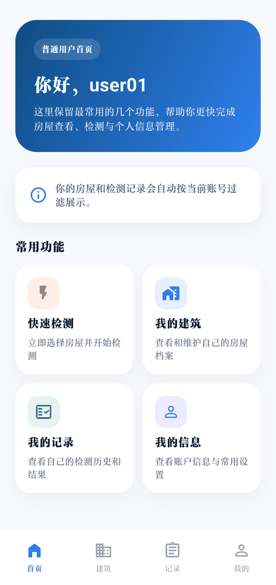
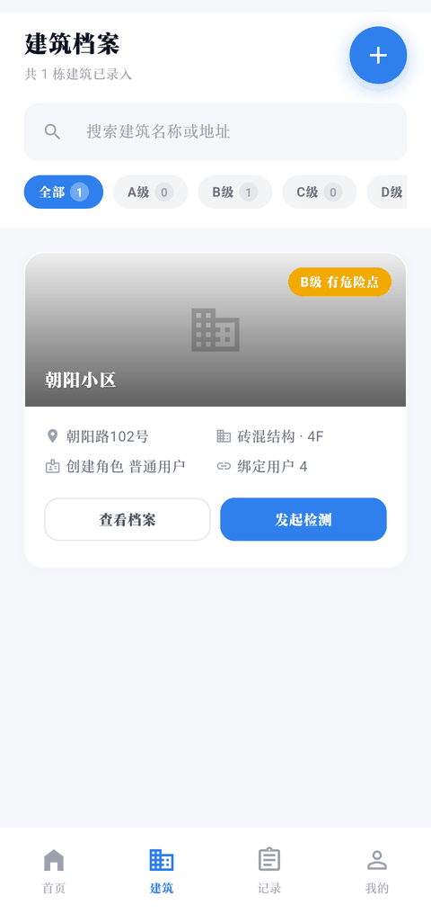
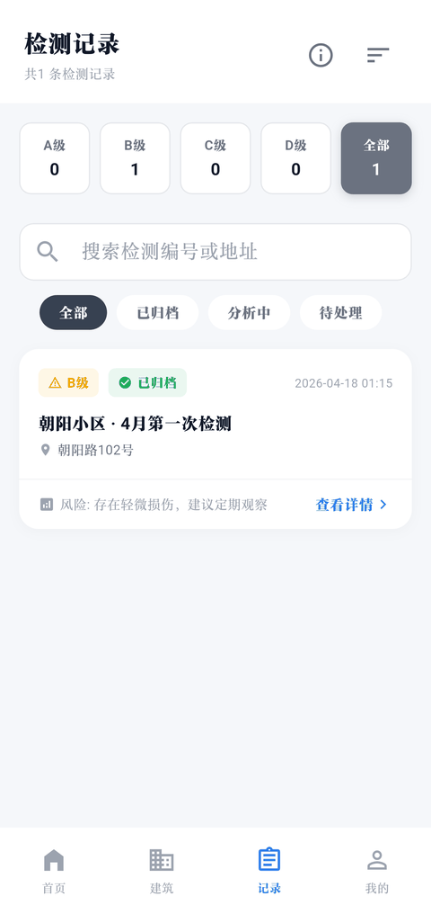
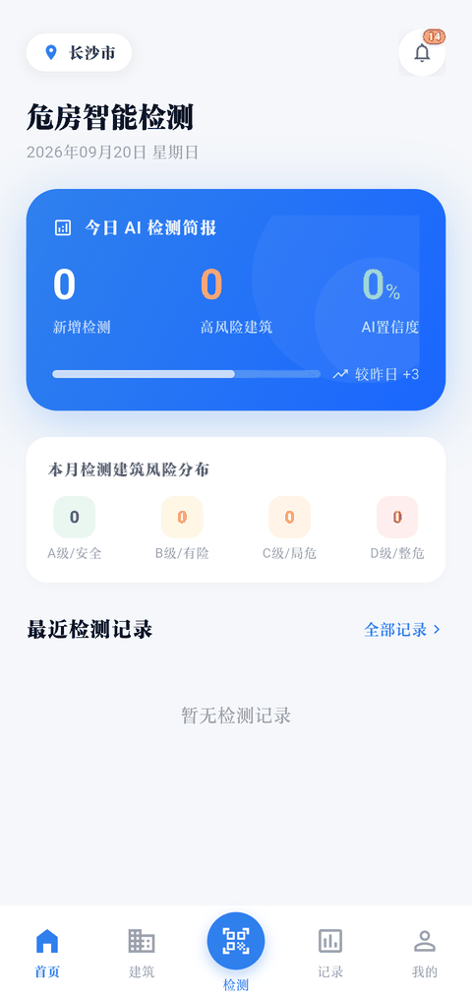

# dangerhouse-mobile-app

危房智能检测系统（dangerHouseSystem）的移动端，Flutter 实现，一套代码跑 Android / iOS / Web / Windows。面向普通用户和检测员：现场拍照、多图上传、调后端 AI 接口检测、看结果，以及建筑档案与检测报告的管理。

| 普通用户首页 | 建筑档案 | 检测记录 | 检测员首页 |
| :---: | :---: | :---: | :---: |
|  |  |  |  |

Flutter SDK 约束 `>=3.2.0 <4.0.0`。主要依赖：

| 依赖 | 声明 | 锁定 |
| :--- | :--- | :--- |
| dio | ^5.4.0 | 5.9.2 |
| flutter_riverpod | ^2.4.9 | 2.6.1 |
| riverpod_annotation | ^2.3.3 | 2.6.1 |
| go_router | ^14.0.0 | 14.8.1 |
| shared_preferences | ^2.2.2 | 2.5.4 |
| json_annotation | ^4.8.1 | 4.9.0 |
| intl | ^0.19.0 | 0.19.0 |
| camera | ^0.12.0 | 0.12.0 |
| image_picker | ^1.2.1 | 1.2.1 |
| permission_handler | ^12.0.1 | 12.0.1 |
| path_provider | ^2.1.5 | 2.1.5 |
| flutter_easyloading | ^3.0.5 | 3.0.5 |

dev_dependencies：build_runner ^2.4.8（2.5.4）、json_serializable ^6.7.1（6.9.5）、riverpod_generator ^2.3.9（2.6.5）、flutter_lints ^3.0.0（3.0.2）、mocktail ^1.0.1（1.0.4）、integration_test（随 Flutter SDK）。

包名 `dangerhouse_app`。pubspec 里的 `version` 是 `1.0.0+1`，`description` 仍是 Flutter 模板文案。pubspec.lock 的包源是国内镜像 `https://pub.flutter-io.cn`。

## 功能范围

**登录与注册。** 登录页只有一个账号输入框加一个密码框，账号框的占位提示是"用户名 / 手机号 / 邮箱"，具体按哪种方式解析由后端决定；没有独立的手机号登录、邮箱登录入口。页面上有"记住我"和"忘记密码？"，后者只弹一句"请联系系统管理员找回密码"，没有对应页面。勾选记住我后账号会写进本地 `remembered_account`，下次进页面自动回填，同时登录请求带 `rememberMe` 给后端。注册页收集用户名、手机号、密码、确认密码，提交前用 `/api/auth/check-username/{username}` 和 `/api/auth/check-phone/{phone}` 做查重。

**双首页。** `PermissionUtil.isInspector` 判定为检测员时进检测员首页（今日检测统计、A/B/C/D 风险分布、最近检测记录、通知角标），否则进普通用户首页。角色来自登录响应里的 `roles` 列表，取值 `ADMIN` / `INSPECTOR` / `USER`。

**建筑档案。** 列表、搜索、详情、新建、编辑、删除，图片上传与展示，归档和已归档危险建筑清单。

**拍摄与检测。** 自定义相机页（camera 插件）和相册选图（image_picker），关联建筑、填检测备注，上传后调 `/api/ai/detect`。结果页在图上标注裂缝，展示 A/B/C/D 评级，支持多图切换，状态手动刷新。

**检测报告。** 报告列表与详情，调 `/api/reports/generate` 生成报告，已有报告直接查看。

**个人中心。** 资料编辑、账户与安全（改密码走 `PUT /api/user/password`）、我的检测档案、通知、帮助、分析设置。

**离线草稿。** 检测草稿以 JSON 存进 SharedPreferences，可手动同步。

## 技术栈

Flutter + Dart，Riverpod 管状态，go_router 管路由与守卫，dio 做网络层并统一处理 Token 注入和错误，json_serializable + build_runner 生成序列化代码，shared_preferences 存 Token 与轻量配置，camera / image_picker / permission_handler 负责采集与权限，flutter_easyloading 统一 loading 与提示，intl 处理日期格式。Riverpod 的作用域没有外包给框架，`lib/main.dart` 里建了一个全局 `ProviderContainer`（`appContainer`），用 `UncontrolledProviderScope` 注入，路由守卫和拦截器要读 Provider 时直接拿它。

## 快速开始

环境要求：Flutter SDK >= 3.2.0，一个可用的后端（默认地址 `http://localhost:8080`）。AI 检测由后端转发，客户端不直连 AI 服务。

```bash
flutter pub get

# 模型有改动时重新生成 *.g.dart，首次 clone 后也建议跑一次
dart run build_runner build --delete-conflicting-outputs

flutter run -d chrome      # Web
flutter run -d windows     # Windows
flutter run -d <device_id> # Android / iOS
```

后端地址通过编译期常量注入，不用改代码：

```bash
flutter run -d chrome --dart-define=APP_BASE_URL=http://192.168.1.100:8080
```

Android 模拟器或真机要访问宿主机上的后端，用端口转发让 localhost 直接可达：

```bash
adb reverse tcp:8080 tcp:8080
```

打包：

```bash
flutter build apk --release
flutter build apk --split-per-abi --release
flutter build web --release
flutter build windows --release
```

`ios/` 工程目录在仓库里，但构建需要 macOS 与 Xcode。

## 目录结构

```
lib/
├── main.dart              # navigatorKey、全局 appContainer、runApp
├── app.dart               # DangerHouseApp：MaterialApp.router + EasyLoading
├── core/
│   ├── auth/              # token_manager.dart
│   ├── constants/         # api_constants、app_colors、app_info
│   ├── errors/            # error_handler、errors、exceptions
│   ├── network/           # dio_client、auth_interceptor
│   ├── router/            # app_router（含 redirect 守卫）、app_routes
│   ├── state/             # base_state
│   └── theme/ utils/
├── data/
│   ├── models/            # auth / building / dashboard / detection / report
│   ├── repositories/      # auth、building、detection、report、offline_detection、task 等 9 个
│   └── sources/           # *_remote_data_source
├── domain/
│   └── entities/          # detection_report、task —— 只有实体，没有 usecase / service
├── providers/             # auth、dashboard、detection、offline_detection、notification 等 10 个
└── presentation/
    ├── login/             # login_activity、register_activity
    ├── home/              # home_activity、home_content、user_home_content、building_*
    ├── capture/           # capture_activity、ai_detection_page、building_create/edit/selection、camera_grid_painter
    ├── result/            # result_activity
    ├── task/              # report_page、report_detail_page
    └── profile/           # profile_activity、user_profile_activity 及各类设置页
```

`assets/images/` 下目前只有 `logo.png` 和 `app_logo_circular.png`，pubspec.yaml 里按目录整体声明。

## 关键设计

**API 基址**在 `lib/core/constants/api_constants.dart`，是编译期常量，没有按平台分支：

```dart
static const String currentBaseUrl = String.fromEnvironment(
  'APP_BASE_URL',
  defaultValue: 'http://localhost:8080',
);

static String get baseUrl => currentBaseUrl;
```

所以 Android 上不存在自动切换成 `10.0.2.2` 的逻辑，模拟器里要么 `adb reverse`，要么用 `--dart-define` 显式传局域网地址。

**超时**：`connectTimeout` 和 `receiveTimeout` 都是 15000 ms，在 `lib/core/network/dio_client.dart` 的 `_createBaseOptions()` 里从 `ApiConstants` 读。拦截器顺序是日志拦截器 → `AuthInterceptor` →（仅 Web 平台）CORS 头拦截器。

**Token 存储**：`lib/core/auth/token_manager.dart` 用 SharedPreferences，四个 key 分别是 `auth_token`、`refresh_token`、`token_expiry`、`user_id`。登录成功时只写了 `auth_token` 和 `user_id`——`saveToken` 的 `refreshToken` / `expiryTime` 是可选参数，登录调用没有传，所以这两个 key 实际是空的。过期判断落在 `_getJwtExpiry()` 上：把 JWT 第二段做 base64Url 解码后取 `exp`。会话时长由后端决定，客户端没有 1 小时 / 3 天这类常量。

**路由守卫**：`lib/core/router/app_router.dart` 里 routerProvider 的 `redirect`。未登录且目标不是 `/login`、`/register` 时跳登录页；已登录还去访问登录页或注册页时跳 `/home`。

**401 处理**：`lib/core/network/auth_interceptor.dart`。`onRequest` 先查 Token 是否过期，过期就直接 reject 一个 401 并跳登录页；`onError` 遇到 401 时调 `authNotifier.handleSessionExpired()` 再 `context.go('/login')`。`/api/auth/login`、`/api/auth/register`、两个查重接口、`/api/health` 在公开路径白名单里，主动退出登录有 3 秒抑制窗口，避免退出瞬间的并发请求弹出"登录已过期"。

**clientType**：登录请求固定带 `clientType: 'APP'`（`lib/data/sources/auth_remote_data_source.dart`），`LoginRequest` 模型的字段默认值同样是 `'APP'`。

**角色控制**：`lib/core/utils/permission_util.dart` 定义 `ADMIN` / `INSPECTOR` / `USER`。`canLoginApp` 只放行普通用户和检测员，管理员登录会被拦下并提示"当前账号不允许登录 App，请联系管理员"（`lib/providers/auth_provider.dart`）；用本地缓存恢复登录态时也会重新校验角色，管理员的缓存不会被当成已登录。

## 测试

```bash
flutter test
flutter test test/unit/repositories/auth_repository_test.dart
flutter test integration_test/app_test.dart -d <device_id>
```

| 文件 | 类型 | 内容 |
| :--- | :--- | :--- |
| test/widget_test.dart | Widget | 登录页冒烟 |
| test/widgets/login_activity_test.dart | Widget | 登录交互：空值校验、密码错误、协议勾选、跳注册 |
| test/unit/repositories/auth_repository_test.dart | 单元 | 登录、注册、Token 读写 |
| test/unit/repositories/building_repository_test.dart | 单元 | 建筑 CRUD |
| test/unit/providers/auth_provider_test.dart | 单元 | 认证状态流转 |
| integration_test/app_test.dart | 集成 | 3 个用例：登录全流程、登录→注册跳转、注册表单校验 |

`test/helpers/` 放测试辅助函数，`test/mocks/` 放 5 个 mocktail mock（auth / building / detection repository、dio client、token manager）。

## 常见问题

**Android 模拟器连不上 localhost 后端。** 代码里没有 `10.0.2.2` 的兼容逻辑，`defaultValue` 就是 `http://localhost:8080`，而模拟器里的 localhost 指向模拟器自身。用 `adb reverse tcp:8080 tcp:8080` 转发，或者 `--dart-define=APP_BASE_URL=http://<局域网IP>:8080`。

**Web 端请求被浏览器 CORS 拦。** `dio_client.dart` 在 `kIsWeb` 时会给请求加 `Access-Control-Allow-*` 头，但放行与否取决于响应头，后端没开对应来源的话浏览器照样拦下来。

**改了模型却报序列化错误。** `lib/data/models/` 和 `lib/domain/entities/` 下的 `*.g.dart` 是生成的，改完模型要重跑 `dart run build_runner build --delete-conflicting-outputs`。

**登录成功但会话不会自动续期。** `refresh_token` 没有落盘，拦截器里也没有刷新 Token 的逻辑，Token 一过期就是直接回登录页。

**管理员账号登不进 App。** 有意为之，见上文"角色控制"。

**应用无法访问相机或相册。** 权限走 permission_handler，Android / iOS 需要在平台工程里声明对应权限，缺失时相机页会直接起不来。
