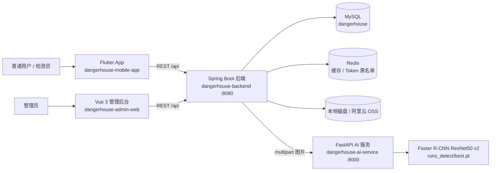
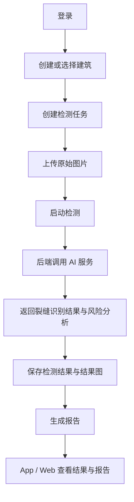
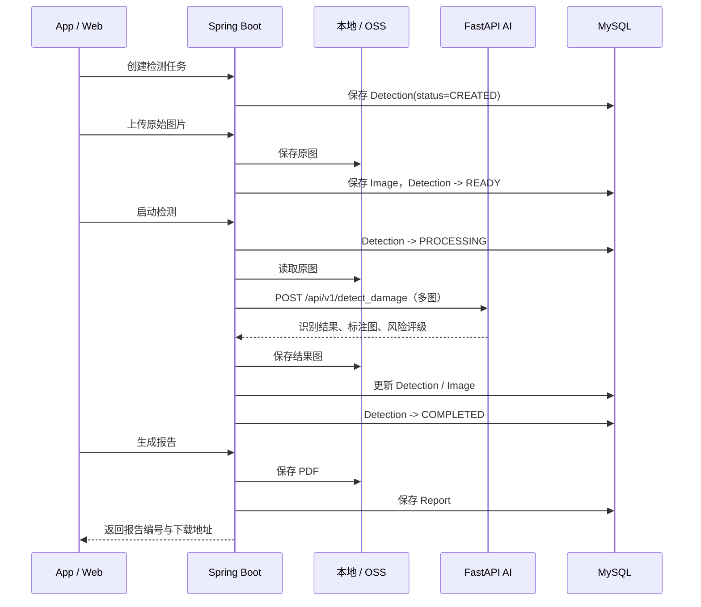
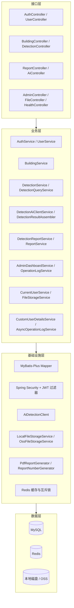
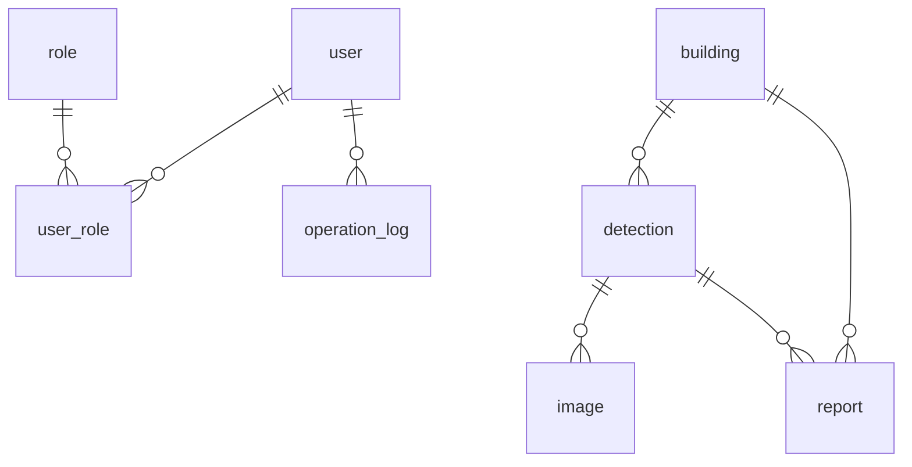

# 危房智诊系统架构

覆盖 `dangerhouse-mobile-app`、`dangerhouse-admin-web`、`dangerhouse-backend`、`dangerhouse-ai-service` 四个模块的协作方式。

## 1. 系统组成



| 端 | 项目目录 | 使用人 | 职责 |
| :--- | :--- | :--- | :--- |
| App | `dangerhouse-mobile-app` | 普通用户、检测员 | 登录注册、建筑建档、现场拍摄、发起检测、查看结果与报告 |
| Web | `dangerhouse-admin-web` | 管理员 | 用户管理、检测员授权、建筑与检测记录管理、看板与操作日志 |
| 后端 | `dangerhouse-backend` | 前后端共用 | 鉴权、权限控制、业务编排、持久化、报告生成、调度 AI 服务 |
| AI 服务 | `dangerhouse-ai-service` | 后端调用 | 裂缝检测、多图去重、风险评级、生成标注图 |

## 2. 角色与权限

### 角色

| 角色编码 | 名称 | 登录端 |
| :--- | :--- | :--- |
| `USER` | 普通用户 | App |
| `INSPECTOR` | 检测员 | App |
| `ADMIN` | 管理员 | Web |

登录端隔离在 `AuthServiceImpl.validateClientAccess` 中强制执行：`clientType=APP` 时拒绝 `ADMIN` 角色，`clientType=WEB` 时拒绝非 `ADMIN` 角色。App 和 Web 分别传 `APP` / `WEB`。

### 接口权限

`SecurityConfig` 放行 `/api-docs/**`、`/swagger-ui*`、`/uploads/**`、`/api/files/**`、`/api/auth/**`，其余请求需要认证。方法级用 `@PreAuthorize` 控制，分布如下：

| 注解 | 处数 | 适用 |
| :--- | :--- | :--- |
| `hasAnyRole('USER','INSPECTOR','ADMIN')` | 23 | 三类角色都能访问的通用接口 |
| `hasRole('ADMIN')` | 5 | 管理类接口；`AdminController` 在类级别声明 |
| `hasAnyRole('INSPECTOR','ADMIN')` | 1 | 删除建筑（`DELETE /api/buildings/{id}`） |

### 数据范围

- 普通用户：只能看到与自己绑定的建筑（`building.owner_user_id`）和自己的检测记录
- 检测员：共享建筑池模式，可查看全部建筑和检测记录
- 管理员：通过 Web 查看全量数据

建筑归属只认 `building.owner_user_id`，不用户主姓名判断权限。

## 3. 核心业务链路

### 主流程



### 检测时序



调用 AI 服务时，图片会先在本地压缩到合理尺寸再发送，避免请求体过大。

### 检测状态

状态在 `DetectionServiceImpl` 中以字符串字面量维护，没有对应枚举类。

| 状态 | 说明 | 可流转到 |
| :--- | :--- | :--- |
| `CREATED` | 任务已创建，尚未上传图片 | `READY`、`CANCELLED` |
| `READY` | 图片已上传，可开始检测 | `PROCESSING`、`CANCELLED` |
| `PROCESSING` | AI 检测中 | `COMPLETED`、`FAILED` |
| `COMPLETED` | 检测完成 | — |
| `FAILED` | 检测失败，可重新发起 | `PROCESSING` |
| `CANCELLED` | 已取消 | — |

### 风险评级

等级由 AI 服务返回，判定维度取裂缝数量与损伤面积占比中的较高者：

| 等级 | 含义 | 裂缝数 | 面积占比 |
| :--- | :--- | :--- | :--- |
| `A` | 结构安全 | < 3 | < 5% |
| `B` | 轻微损伤 | ≥ 3 | ≥ 5% |
| `C` | 局部危房 | ≥ 6 | ≥ 15% |
| `D` | 整幢危房 | > 10 | > 30% |

多图检测时，AI 服务对所有图的裂缝框中心做 DBSCAN 聚类（`eps=50`、`min_samples=1`）去重，建筑级裂缝数取去重后的簇数，面积占比取各图最大值。

## 4. 后端内部分层



操作日志写库走独立线程池 `operationLogExecutor`（核心 2、最大 8、队列 500），不阻塞主请求。

## 5. 数据模型

八张表：`user`、`role`、`user_role`、`building`、`detection`、`image`、`report`、`operation_log`。



### 关键归属字段

| 字段 | 表 | 说明 |
| :--- | :--- | :--- |
| `owner_user_id` | `building` | 绑定的普通用户账号 ID，允许为空，兼容户主未注册但已建档 |
| `created_by` | `building` | 房屋创建人 ID |
| `created_by_role` | `building` | 创建人角色 ID（存 ID，不存角色名） |
| `assigned_inspector_id` | `building` | 当前主要跟进的检测员 ID |
| `user_id` | `detection` | 检测记录发起人 ID，删除用户时置空 |

### 已知不一致

`image.image_type` 的列注释写的是「墙体/屋顶/整体」，但代码目前只写入 `ORIGINAL` 一个值，用于标记 AI 生成的结果图。

## 6. 技术栈

| 模块 | 技术 |
| :--- | :--- |
| App | Flutter、Dart、Riverpod、Dio、go_router、SharedPreferences |
| Web | Vue 3、TypeScript、Element Plus、Pinia、Vite、ECharts |
| 后端 | Spring Boot 3.2、Spring Security、MyBatis-Plus、JJWT、OpenPDF、Hutool |
| AI 服务 | FastAPI、PyTorch、torchvision、OpenCV、scikit-learn、PyQt6 |
| 数据与中间件 | MySQL 8、Redis 6 |

## 7. 目录结构

```text
dangerHouseSystem/
├── dangerhouse-mobile-app/     Flutter App
│   └── lib/                    core（路由/网络/常量）、data、domain、providers、presentation
├── dangerhouse-admin-web/      Vue 3 管理后台
│   └── src/                    api、layout、store、views、utils、styles
├── dangerhouse-backend/        Spring Boot 后端
│   ├── sql/                    建表脚本与数据库说明
│   └── src/main/java/com/dz/dangerhouse/
│       ├── controller/         REST 接口
│       ├── service/            业务逻辑
│       ├── client/             AI 服务客户端
│       ├── mapper/             数据访问
│       ├── entity/ dto/        实体与传输对象
│       ├── cache/ config/      缓存封装与配置
│       └── util/ filter/       工具类与 JWT 过滤器
└── dangerhouse-ai-service/     FastAPI AI 服务
    ├── api_server.py           HTTP 推理服务
    ├── run_dectect.py          训练与评估脚本
    └── damage_detector_qt.py   本地调试 GUI
```
