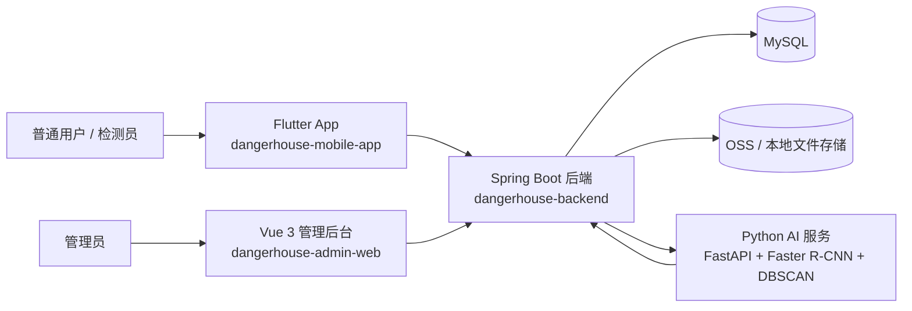
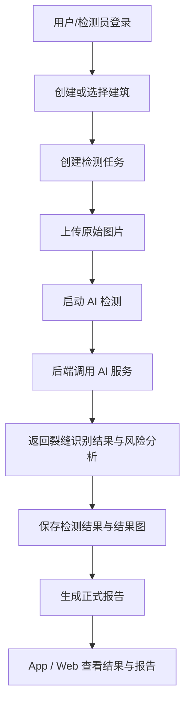
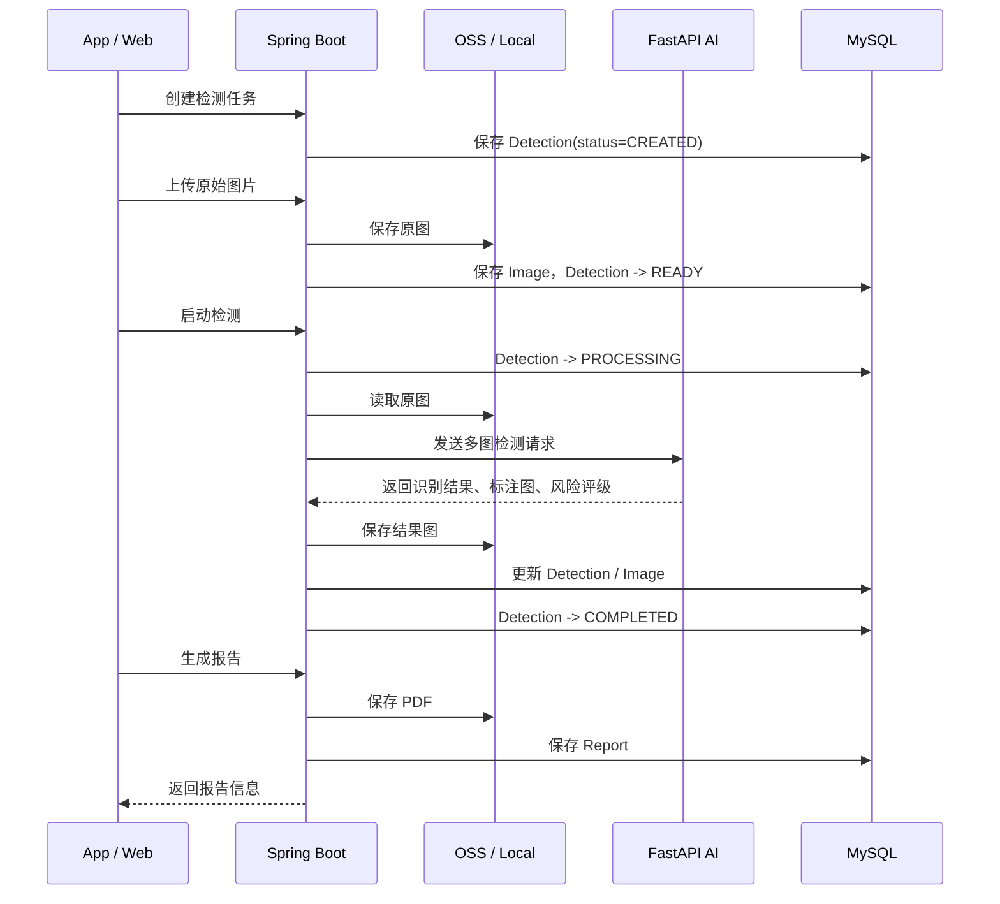
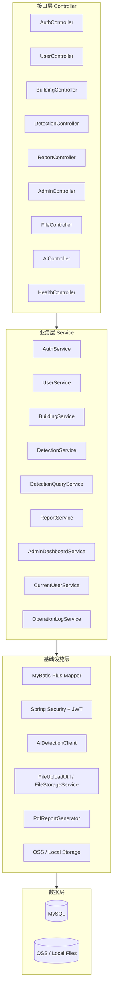

# 危房智诊系统架构总览

> 用途：帮助新成员、产品、测试、前后端开发快速了解项目  
> 适用范围：`dangerhouse-mobile-app`、`dangerhouse-admin-web`、`dangerhouse-backend` 以及 `dangerhouse-ai-service` 协作链路

---

## 1. 项目一句话说明

危房智诊系统是一套面向建筑安全巡检与风险研判的智能化平台，围绕“建筑建档、现场检测、AI 分析、报告生成、后台管理”五个核心环节展开，形成 App、Web、后端与 AI 服务协同工作的完整业务闭环。

---

## 2. 先看整体

### 2.1 系统总体架构图



### 2.2 三端分工

| 端 | 项目目录 | 主要使用人 | 主要职责 |
| --- | --- | --- | --- |
| App | `dangerhouse-mobile-app` | 普通用户、检测员 | 登录、建档、现场检测、查看检测记录、查看报告、维护个人信息 |
| Web | `dangerhouse-admin-web` | 管理员 | 后台管理、用户管理、设置检测员、查看建筑/检测/报告/日志 |
| 后端 | `dangerhouse-backend` | 前后端共用 | 鉴权、权限控制、业务编排、数据存储、报告生成、AI 调用 |

---

## 3. 角色与权限模型

### 3.1 角色定义

| 角色 | 登录端 | 核心能力 |
| --- | --- | --- |
| `USER` 普通用户 | App | 注册登录、快速检测、创建自己的建筑、查看自己的建筑/检测记录/账户信息 |
| `INSPECTOR` 检测员 | App | 现场创建建筑、执行检测、查看共享建筑池和检测记录 |
| `ADMIN` 管理员 | Web | 后台管理、用户管理、设置检测员、查看统计和日志 |

### 3.2 当前权限边界

| 场景 | USER | INSPECTOR | ADMIN |
| --- | --- | --- | --- |
| 登录 App | 是 | 是 | 否 |
| 登录 Web | 否 | 否 | 是 |
| 创建建筑 | 是 | 是 | 否 |
| 查看自己的建筑 | 是 | 是 | 是 |
| 查看全部建筑 | 否 | 是 | 是 |
| 查看自己的检测记录 | 是 | 是 | 是 |
| 查看全部检测记录 | 否 | 是 | 是 |
| 设置检测员 | 否 | 否 | 是 |
| 查看管理后台统计 | 否 | 否 | 是 |

### 3.3 当前数据范围规则

- 普通用户：只能看到与自己绑定的建筑和自己的检测记录。
- 检测员：当前采用共享建筑池模式，可查看全部建筑和检测记录。
- 管理员：通过 Web 查看后台全量数据。
- 房屋归属通过 `building.owner_user_id` 判断，不使用户主姓名做权限判断。

---

## 4. 核心业务链路

### 4.1 业务主流程



### 4.2 检测时序图



### 4.3 检测状态流转

| 状态 | 说明 |
| --- | --- |
| `CREATED` | 任务已创建，尚未上传图片 |
| `READY` | 图片已上传，可开始检测 |
| `PROCESSING` | AI 检测中 |
| `COMPLETED` | 检测完成 |
| `FAILED` | 检测失败 |
| `CANCELLED` | 检测已取消 |

---

## 5. 后端内部架构

### 5.1 分层结构



### 5.2 后端职责拆分

| 模块 | 主要职责 |
| --- | --- |
| 鉴权与权限 | 登录、JWT 签发、登录端限制、方法级权限控制 |
| 用户管理 | 用户资料、头像、密码、用户状态、设置检测员 |
| 建筑管理 | 建筑建档、图片上传、归属字段维护、共享建筑池查询 |
| 检测管理 | 创建任务、上传图片、启动检测、状态流转、结果查询 |
| 报告管理 | 报告生成、报告详情、PDF 下载 |
| 管理后台 | 仪表盘、操作日志、AI 模型信息 |
| 文件访问 | 图片/报告上传、预览、下载代理 |

---

## 6. 关键数据模型

### 6.1 核心业务对象

| 对象 | 作用 |
| --- | --- |
| `user` | 平台用户，承载 `USER / INSPECTOR / ADMIN` |
| `role` / `user_role` | 角色与角色分配关系 |
| `building` | 建筑档案，承载建筑归属、创建人、跟进检测员等信息 |
| `detection` | 检测任务与检测结果 |
| `image` | 原图和结果图 |
| `report` | 检测报告 |
| `operation_log` | 后台操作日志 |

### 6.2 当前最关键的归属字段

| 字段 | 所在表 | 作用 |
| --- | --- | --- |
| `owner_user_id` | `building` | 普通用户与建筑绑定关系 |
| `created_by` | `building` | 建筑创建人 ID |
| `created_by_role` | `building` | 建筑创建人角色 ID |
| `assigned_inspector_id` | `building` | 当前跟进检测员 |
| `user_id` | `detection` | 当前检测记录发起人 |

### 6.3 当前数据设计特点

- `building.created_by_role` 存储的是角色 ID，不存角色名称。
- `building.owner_user_id` 允许为空，兼容“户主未注册但已建档”的场景。
- `detection.user_id` 当前表示“检测记录发起人”，适配现阶段“创建即检测”的业务模式。

---

## 7. 技术栈速览

### 7.1 App

| 项 | 技术 |
| --- | --- |
| 框架 | Flutter 3.x |
| 语言 | Dart |
| 状态管理 | Riverpod |
| 网络请求 | Dio |
| 路由 | go_router |
| 本地存储 | SharedPreferences |

### 7.2 Web

| 项 | 技术 |
| --- | --- |
| 框架 | Vue 3 |
| 语言 | TypeScript |
| UI | Element Plus |
| 状态管理 | Pinia |
| 构建 | Vite |
| 图表 | ECharts |

### 7.3 后端

| 项 | 技术 |
| --- | --- |
| 框架 | Spring Boot 3.2 |
| 安全 | Spring Security + JWT |
| ORM | MyBatis-Plus |
| 数据库 | MySQL 8 |
| 文档 | Swagger / SpringDoc |
| 文件 | OSS / 本地文件存储 |

### 7.4 AI 服务

| 项 | 技术 |
| --- | --- |
| 服务框架 | FastAPI |
| 目标检测 | Faster R-CNN ResNet50 v2 |
| 去重聚类 | DBSCAN |
| 输出 | 风险等级、裂缝信息、结果图 |

---

## 8. 仓库结构速览

```text
dangerHouseSystem/
├── dangerhouse-mobile-app/   # Flutter App
├── dangerhouse-admin-web/    # Vue 3 管理后台
├── dangerhouse-backend/      # Spring Boot 后端
├── dangerhouse-ai-service/   # FastAPI AI 服务
├── 危房智诊系统架构图.md        # 当前文档
```

### 8.1 App 重点目录

```text
dangerhouse-mobile-app/lib/
├── core/                     # 核心能力：路由、网络、异常、常量
├── data/                     # 数据模型、仓库、远端数据源
├── presentation/             # 页面与组件
├── providers/                # 状态管理
└── main.dart                 # 应用入口
```

### 8.2 Web 重点目录

```text
dangerhouse-admin-web/src/
├── api/                      # 接口定义
├── layout/                   # 后台框架布局
├── store/                    # Pinia 状态
├── views/                    # 页面
├── utils/                    # 工具函数
└── styles/                   # 全局样式
```

### 8.3 后端重点目录

```text
dangerhouse-backend/src/main/java/com/dz/dangerhouse/
├── controller/               # 控制器
├── service/                  # 业务服务
├── mapper/                   # 数据访问
├── dto/                      # 请求/响应对象
├── entity/                   # 实体
├── config/                   # 安全与基础配置
├── util/                     # 工具类
└── client/                   # 外部服务调用
```

---

## 9. 新成员建议阅读顺序

### 如果你是产品或测试

1. 看“2. 先看整体”
2. 看“3. 角色与权限模型”
3. 看“4. 核心业务链路”
4. 再去看接口文档和测试用例

### 如果你是 App / Web 前端

1. 看“2. 先看整体”
2. 看“3. 角色与权限模型”
3. 看“6. 关键数据模型”
4. 再看对应端的 README 和联调接口文档

### 如果你是后端开发

1. 看“4. 核心业务链路”
2. 看“5. 后端内部架构”
3. 看“6. 关键数据模型”
4. 再进入 `dangerhouse-backend` 项目读 Service 和 Controller

---

## 10. 当前系统特点总结

- 这是一个典型的前后端分离 + AI 服务协同项目。
- App 负责现场业务，Web 负责后台管理，后端负责统一业务编排。
- 当前权限已经按 `USER / INSPECTOR / ADMIN` 三类角色完成分级。
- 当前数据模型已经支持“普通用户个人归属 + 检测员共享建筑池”的业务模式。
- 当前项目最重要的主链路是：建筑建档 -> 检测任务 -> 图片上传 -> AI 分析 -> 报告生成。

如果只想快速抓住项目核心，可以记住一句话：

> 这个项目本质上是在用 App 和 Web 驱动一套后端业务平台，再由后端去统一调度 AI 服务完成危房检测与报告生成。
